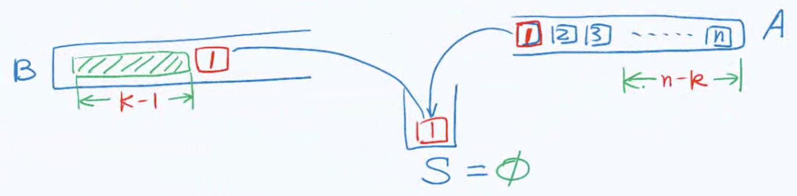

## 栈
栈是一种具有【先进后出】特性的数据结构，通常于辅助实现非递归算法，如DFS。栈的实现通常是基于数组或者链表。以数组为例，我们可以将数组头视作栈底，数组尾视作栈顶。插入和删除操作都是 $O(1)$ 时间。接口定义如下：

```cpp
template <typename T>
class stack: public vector<T> {
public:
	vois push(T const &e) {
		insert(size(), e);
	}
	T pop() {
		return remove(size() - 1);
	}
	T &top() {
		return (*this)[size()-1];
	}
};
```

### 两个栈实现队列
```cpp
class MyQueue {
    stack<int> s1, s2;
public:
    /** Initialize your data structure here. */
    MyQueue() {

    }

    /** Push element x to the back of queue. */
    void push(int x) {
        s1.push(x);
    }

    /** Removes the element from in front of queue and returns that element. */
    int pop() {
        int ans = peek();
        s2.pop();
        return ans;
    }

    /** Get the front element. */
    int peek() {
        if (s2.empty()) {
            while (!s1.empty()) {
                s2.push(s1.top());
                s1.pop();
            }
        }
        return s2.top();
    }

    /** Returns whether the queue is empty. */
    bool empty() {
        return s1.empty() && s2.empty();
    }
};

/**
 * Your MyQueue object will be instantiated and called as such:
 * MyQueue* obj = new MyQueue();
 * obj->push(x);
 * int param_2 = obj->pop();
 * int param_3 = obj->peek();
 * bool param_4 = obj->empty();
 */
```
时间复杂度：push 和 empty 为 $O(1)$，pop 和 peak 的均摊为 $O(1)$，空间复杂度：$O(n)$。

### 最小栈
实现一个最小栈，时刻获取栈内的最小值。

**「分析」**

用两个vector实现。每次「入栈」时，将当前最小元素压入。

```cpp
/*
Input
["MinStack","push","push","push","getMin","pop","top","getMin"]
[[],[-2],[0],[-3],[],[],[],[]]

Output
[null,null,null,null,-3,null,0,-2]

Explanation
MinStack minStack = new MinStack();
minStack.push(-2);
minStack.push(0);
minStack.push(-3);
minStack.getMin(); // return -3
minStack.pop();
minStack.top();    // return 0
minStack.getMin(); // return -2
*/
class MinStack {
    vector<int> arr1, arr2;
public:
    /** initialize your data structure here. */
    MinStack() {

    }
    
    void push(int val) {
        arr1.emplace_back(val);
        if (arr2.empty() || arr2.back() > val) {
            arr2.emplace_back(val);
        }
        else { arr2.emplace_back(arr2.back()); }
    }
    
    void pop() {
        arr1.pop_back();
        arr2.pop_back();
    }
    
    int top() {
        return arr1.back();
    }
    
    int getMin() {
        return arr2.back();
    }
};
```
时间复杂度：$O(1)$，空间复杂度：$O(n)$。

### 进制转化
进制转化（Base Convert）将一种进制下的值转化成另一种进值下的值，如 $89_{10} = 1011001_{2}$。

$$
\begin{aligned}
\frac{89}{2} & = 44, \quad & \text{mod} = 1 \\
\frac{44}{2} & = 22, \quad & \text{mod} = 0 \\
\frac{22}{2} & = 11, \quad & \text{mod} = 0 \\
\frac{11}{2} & = 5, \quad & \text{mod} = 1 \\
\frac{5}{2} & = 2, \quad & \text{mod} = 1 \\
\frac{2}{2} & = 1, \quad & \text{mod} = 0 \\
\frac{1}{2} & = 0, \quad & \text{mod} = 1
\end{aligned}
$$

有底向上记录余数，便得 1011001。

```cpp
void convert(stack<char> &S, _int64 n, int base) {
    static char digit[] = {'0', '1', '2', '3', '4', '5',
        '6', '7', '8', '9', 'A', 'B', 'C', 'D', 'E', 'F'};
    while (n > 0) {
        S.push(digit[n%base]);
		n /= base;
    }
}
```

### 检查括号
给定一个括号序列，检查是否是有效的组合。

```cpp
bool paren(const char exp[], int lo, int hi) {
	stack<char> S;
	for (int i = lo; i < hi; i++) {
		if ('(' == exp[i]) {
			S.push(exp[i]);
		} else if (!S.empty()) {
			S.pop();
		} else {
			return false;
		}
	}
	return S.empty();
}
```

### 栈排列
栈排列（Stack Permutation）考虑一个栈 A，从栈顶到栈尾元素依次如下 $< a_{1}, a_{2}, \cdots, a_{n}]$，B 和 S 是两个空栈。只允许如下两种操作

1）S.push(A.pop())

2）B.push(S.pop())



将 A 所有的元素转移到 B $[ a_{k1}, a_{k2}, \cdots, a_{kn} >$，我们称 B 是 A 的一个栈排列。加入一个栈有 n 个元素，

$$
\begin{aligned}
& SP(n)=\sum_{k=1}^{n}SP(k-1)\times SP(n-k) \\
& SP(1)=1
\end{aligned} \Rightarrow
SP(n)=catalan(n)=\frac{(2n)!}{(n+1)!n!}
$$

如果一个栈有三个元素 i，j，k（由底到顶），那么 k，j，i 将不会是一个栈排列。


## 队列
队列是一种具有【先进先出】特性的数据结构，用于实现BFS算法。接口如下：

```cpp
template <typename T>
class queue: public List<T> {
	void enqueue(T const &e) {
		insertAsLast(e);
	}
	T dequeue() {
		return remove(first());
	}
	T &front() {
		return first()->data;
	}
};
```

### 用队列实现栈
只用一个队列实现栈的功能：压入、弹出、取栈顶元素

```cpp
class MyStack {
    queue<int> q;
public:
    /** Initialize your data structure here. */
    MyStack() {

    }
    
    /** Push element x onto stack. */
    void push(int x) {
        int n = (int)q.size();
        q.push(x);
        for (int i = 0; i < n; i++) {
            q.push(q.front());
            q.pop();
        }
    }
    
    /** Removes the element on top of the stack and returns that element. */
    int pop() {
        int ans = q.front();
        q.pop();
        return ans;
    }
    
    /** Get the top element. */
    int top() {
        return q.front();
    }
    
    /** Returns whether the stack is empty. */
    bool empty() {
        return q.empty();
    }
};
```
时间复杂度：push 是 $O(n)$，top 和 pop 都是 $O(1)$，空间复杂度：$O(n)$