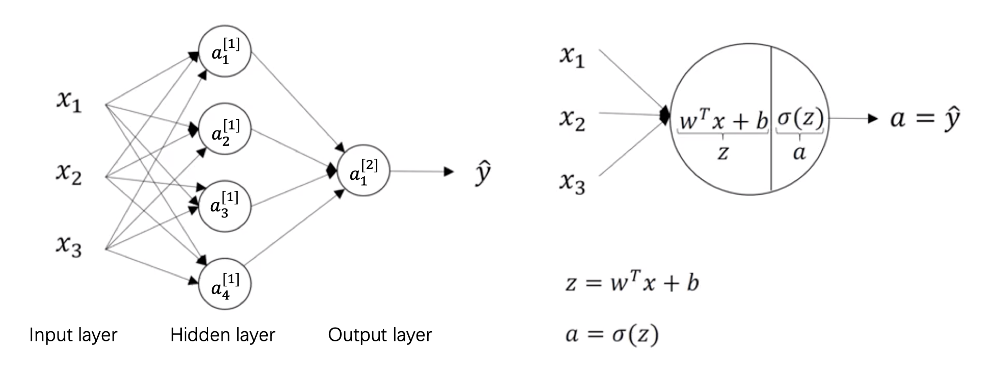

## 基础
神经网络表示

$\bigstar$ X 是一个矩阵，每一行是一条样本

$\bigstar$ $a^{[2]}$ 代表第二层激活函数后的向量，$a^{[2](12)}$ 代表第二层第12个训练样本

$\bigstar$ $a_{4}^{[2]}$ 是第2层里第4个神经元的激活函数值

$\bigstar$ 层的数目等于n层隐层和1层输出层




## 前馈网络
向量化表示层 $l \in [1, L]$，在第 $l^{th}$ 层，$W^{[l]}$ 的尺寸是（$n^{[l]}$, $n^{[l-1]}$），$b^{[l]}$ 的尺寸是（$n^{[l]}$, 1），这里 $n^{[l]}$ 是 $l^{th}$ 层的神经元数目。l = 0 表示输入层。例如：$W^{[1]}$ 的尺寸是 (4, 3), $b^{[1]}$ 是 (4, 1), $W^{[2]}$ 是 (1, 4), $b^{[2]}$ 是 (1, 1), $Z^{[1]}$ 是 (4, m)。

对单一神经元而言

$$
\begin{aligned}
& a_{1}^{[1]} = \sigma(z_{1}^{[1]}) \\
& z_{1}^{[1]} = w_{1}^{[1]T} x + b_{1}^{[1]} \\
& 
x =
\begin{bmatrix}
x_{1}\\
x_{2}\\
x_{3}
\end{bmatrix} \\
& 
w_{1}^{[1]T} =
\begin{bmatrix}
w_{1,1} & w_{1,2} & w_{1, 3}
\end{bmatrix} \\
& 
b_{1}^{[1]} =
\begin{bmatrix}
R
\end{bmatrix}
\end{aligned}
$$

多个神经元如下：

$$
\begin{aligned}
&
\begin{bmatrix}
z_{1}^{[1]}\\
z_{2}^{[1]}\\
z_{3}^{[1]}\\
z_{4}^{[1]}
\end{bmatrix} =
\begin{bmatrix}
w_{1}^{[1]T}\\
w_{2}^{[1]T}\\
w_{3}^{[1]T}\\
w_{4}^{[1]T}
\end{bmatrix}
\begin{bmatrix}
x_{1}\\
x_{2}\\
x_{3}
\end{bmatrix} +
\begin{bmatrix}
b_{1}^{[1]}\\
b_{2}^{[1]}\\
b_{3}^{[1]}\\
b_{4}^{[1]}
\end{bmatrix} \\
& Z^{[1]} = W^{[1]}x + b^{[1]} \\
& A^{[1]} = \sigma(Z^{[1]}) \\
& Z^{[2]} = W^{[2]} A^{[1]} + b^{[2]} \\
& A^{[2]} = \sigma(Z^{[2]})
\end{aligned}
$$

所以，$W^{[1]}$ 的尺寸是 $4 \times 3$，$b^{[1]}$ 是 $4 \times 1$ (scalar)；$W^{[2]}$ 是 $1 \times 4$，$b^{[2]}$ 是 $1 \times 1$

x 以列向量的形式表示一条样本，扩充到 m 条样本后。

$$
\begin{aligned}
& Z^{[l]} = W^{[l]} A^{[l-1]} + b^{[l]}, \quad A^{[l]} = g^{[l]}(Z^{[l]}) \\
&
X =
\begin{bmatrix}
| & | & ... & |\\
x^{(1)} & x^{(2)} & ... & x^{(m)}\\
| & | & ... & |
\end{bmatrix}, \quad
x^{(i)} =
\begin{bmatrix}
x_{1}^{(i)}\\
x_{2}^{(i)}\\
x_{3}^{(i)}
\end{bmatrix} \\
&
A^{[1]} =
\begin{bmatrix}
| & | & ... & |\\
a^{[1](1)} & a^{[1](2)} & ... & a^{[1](m)}\\
| & | & ... & |
\end{bmatrix} \\
& a^{[1](i)} = \sigma(z^{[1](i)}) \\
&
z^{[1](i)} =
\begin{bmatrix}
z_{1}^{[1](i)}\\
z_{2}^{[1](i)}\\
z_{3}^{[1](i)}\\
z_{4}^{[1](i)}
\end{bmatrix} =
\begin{bmatrix}
w_{1}^{[1]T}\\
w_{2}^{[1]T}\\
w_{3}^{[1]T}\\
w_{4}^{[1]T}
\end{bmatrix}
\begin{bmatrix}
x_{1}^{(i)}\\
x_{2}^{(i)}\\
x_{3}^{(i)}
\end{bmatrix} +
\begin{bmatrix}
b_{1}^{[1]}\\
b_{2}^{[1]}\\
b_{3}^{[1]}\\
b_{4}^{[1]}
\end{bmatrix} \\
& Z^{[1]} = W^{[1]}X + b^{[1]} \\
& A^{[1]} = g^{[1]}(Z^{[1]}) \\
& Z^{[2]} = W^{[2]}A^{[1]} + b^{[2]} \\
& A^{[2]} = g^{[2]}(Z^{[2]}) = \hat{Y_{}}
\end{aligned}
$$


## 反向传播

$$
\begin{aligned}
& dA^{[l]} = (W^{[l+1]})^{T} dZ^{[l+1]} \\
& dZ^{[l]} = dA^{[l]} * [g^{[l]}(Z^{[l]})]' \quad \text{where * means element-wise multiplication} \\
& dW^{[l]} = \frac{1}{m} dZ^{[l]} (A^{[l-1]})^{T} \\
& db^{[l]} = \frac{1}{m} \sum_{i=1}^{m} dZ^{[l]}
\end{aligned}
$$

$$
\begin{aligned}
& L(\hat{Y_{}}, Y) = -[Y \log\hat{Y_{}} + (1 - Y)\log(1 - \hat{Y_{}})] \\
& dZ^{[2]} = A^{[2]} - Y \\
& dW^{[2]} = \frac{1}{m} dZ^{[2]} (A^{[1]})^{T} \\
& db^{[2]} = \frac{1}{m} \sum_{i=1}^{m} dZ^{[2]} \\
& dZ^{[1]} = dA^{[1]} [g^{[1]}(dZ^{1})]' = (W^{[2]})^{T}dZ^{[2]} [g^{[1]}(dZ^{1})]' \\
& dW^{[1]} = \frac{1}{m} dZ^{[1]} X^{T} \\
& db^{[1]} = \frac{1}{m} \sum_{i=1}^{m} dZ^{[1]}
\end{aligned}
$$

$\bigstar$ 超参数：学习率，迭代数目、隐层个数、隐层单元数、激活函数

```python
A = np.random.randn(4,3)
B = np.sum(A, axis=1, keepdims=True)  # B.shape is (4, 1)

dw2 = 1/m * np.dot(dZ2, A1.T)  # Backprop
db2 = 1/m * np.sum(dZ2, axis=1, keepdims=False)
dW1 = 1/m * np.dot(dZ1, X.T)
db1 = 1/m * np.sum(dZ1, axis=1, keepdims=False)
```


## Jacobin
考虑一个从向量到向量的映射

g(x): $(x_{1},  ..., x_{n}) \rightarrow (g_{1}, ..., g_{m})$

f(g): $(g_{1}, ..., g_{m}) \rightarrow (f_{1}, ..., f_{k})$ this will be useful for RNN

h(x) = f(g(x)): $(x_{1}, ..., x_{n}) \rightarrow (h_{1}, ..., h_{k}) = (f_{1}, ..., f_{k})$

The matrix of partial derivatives $\frac{\partial h_{i}}{\partial x_{j}}$ is called the Jacobian

$$
\begin{aligned}
& J^{h} =
\begin{pmatrix}
\frac{\partial h_{1}}{\partial x_{1}} & \cdots & \frac{\partial h_{1}}{\partial x_{n}}\\
\vdots & \ddots & \vdots\\
\frac{\partial h_{k}}{\partial x_{1}} & \cdots & \frac{\partial h_{k}}{\partial x_{n}}
\end{pmatrix} \\
& J_{i, j}^{h} = \frac{\partial h_{i}}{\partial x_{j}} = \sum_{l}\frac{\partial f_{i}}{\partial g_{l}}\frac{\partial g_{l}}{\partial x_{j}} = \sum_{l}J_{i, l}^{f} \cdot J_{l, j}^{g} \\
& J^{h} = J^{f} \cdot J^{g}
\end{aligned}
$$


## 张量微分

$$
\begin{aligned}
&
\begin{aligned}
C &= AB \\
&=
\begin{pmatrix}
a_{1, 1} & a_{1, 2}\\
a_{2, 1} & a_{2, 2}
\end{pmatrix} \cdot
\begin{pmatrix}
b_{1, 1} & b_{1, 2}\\
b_{2, 1} & b_{2, 2}
\end{pmatrix} \\
&=
\begin{pmatrix}
a_{1, 1}b_{1, 1}+a_{1, 2}b_{2, 1} & a_{1, 1}b_{1, 2}+a_{1, 2}b_{2, 2}\\
a_{2, 1}b_{1, 1}+a_{2, 2}b_{2, 1} & a_{2, 1}b_{1, 2}+a_{2, 2}b_{2, 2}
\end{pmatrix}
\end{aligned}
\end{aligned}
$$

$$
\begin{aligned}
\frac{\partial C}{\partial A} &= \{ \frac{\partial c_{i, j}}{\partial a_{k, l}} \}_{i, j, k, l} \\
&=
\begin{pmatrix}
\frac{\partial c_{1, 1}}{\partial A} & \frac{\partial c_{1, 2}}{\partial A}\\
\frac{\partial c_{2, 1}}{\partial A} & \frac{\partial c_{2, 2}}{\partial A}
\end{pmatrix} \\
&=
\begin{pmatrix}
\begin{bmatrix}
b_{1, 1} & b_{2, 1}\\
0 & 0
\end{bmatrix} &
\begin{bmatrix}
b_{1, 2} & b_{2, 2}\\
0 & 0
\end{bmatrix}\\
\begin{bmatrix}
0 & 0\\
b_{1, 1} & b_{2, 1}
\end{bmatrix} &
\begin{bmatrix}
0 & 0\\
b_{1, 2} & b_{2, 2}
\end{bmatrix}
\end{pmatrix}
\end{aligned}
$$

一个 3-d 张量对 4-d 张量微分的维度（dimensions）是 7。


## 向量化
无论何时，避免显示for循环

$$
\text{z = np.dot(w, x)}
$$

$\bigstar$ Broadcasting

$$
\begin{aligned}
& (m, n) + R = (m, n) \\
& (m, n) + (1, n) = (m, n) \\
& (m, n) + (m, 1) = (m, n)
\end{aligned}
$$

例如

$$
\begin{bmatrix}
1 & 2 & 3\\
4 & 5 & 6
\end{bmatrix} + 
\begin{bmatrix}
100 & 200 & 300
\end{bmatrix} =
\begin{bmatrix}
101 & 202 & 303\\
104 & 205 & 306
\end{bmatrix}
$$

$$
\begin{bmatrix}
1 & 2 & 3\\
4 & 5 & 6
\end{bmatrix} + 
\begin{bmatrix}
100\\
200
\end{bmatrix} =
\begin{bmatrix}
101 & 102 & 103\\
104 & 205 & 206
\end{bmatrix}
$$


## Gradient checking
将参数（$W^{[1]}$, $b^{[1]}$, ..., $W^{[L]}$, $b^{[L]}$）和参数的导数（$dW^{[1]}$, $db^{[1]}$, ..., $dW^{[L]}$, $db^{[L]}$）取出并形成新的向量 $\theta$ 和 $d\theta$

$$
J(\theta) = J(\theta_{1}, \theta_{2}, ..., \theta_{n})
$$

对每一个参数 $\theta_{i}$，我们检查

$$
d\theta_{i}^{\text{approx}} = \frac{J(\theta_{1}, ..., \theta_{i} + \epsilon, ..., \theta_{n})-J(\theta_{1}, ..., \theta_{i} - \epsilon, ..., \theta_{n})}{2\epsilon} \approx d\theta_{i}
$$

另一种形式

$$
\frac{\left \| d\theta_{i}^{\text{approx}} - d\theta_{i} \right \|_{2}}{\left \| d\theta_{i}^{\text{approx}} \right \|_{2} + \left \| d\theta_{i} \right \|_{2}} < 10^{-7}
$$

$\bigstar$ 仅用作 debug，不用在训练阶段使用
