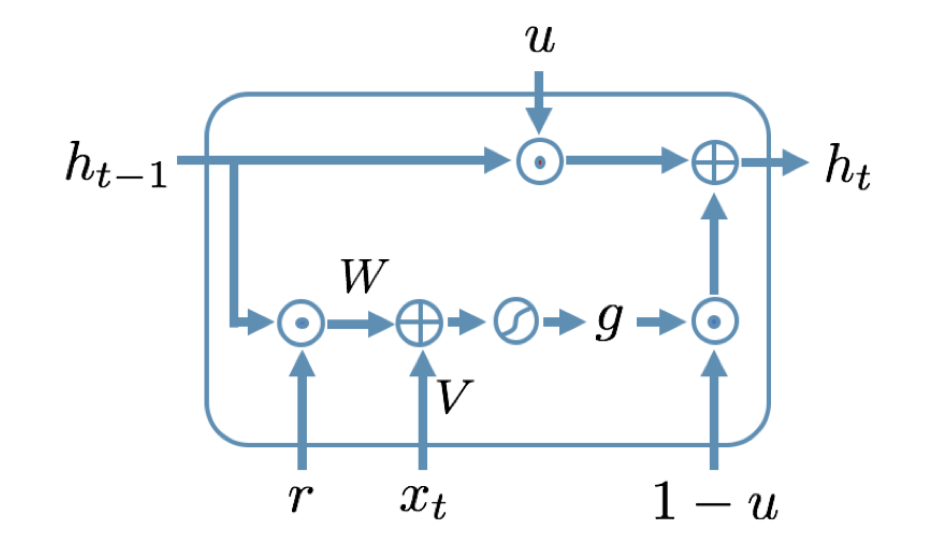
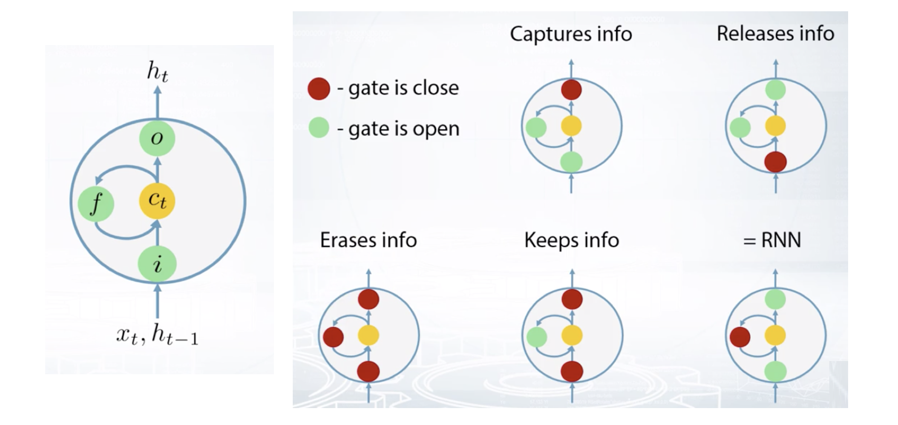

## 符号
token：单词

文本：一个序列的token

输入：$x_{t}, t \in [1, T_{x}]$，表示序列中第 t 个 token，$T_{x}$ 代表文本长度。

输出：$\hat{y}_{t}, t \in [1, T_{y}]$，表示第 t 个预测 token，$T_{y}$ 代表输出长度。

中间结果：$h_{t}, t \in [1, T_{x}]$

真实标签：$y_{t}$

损失函数：$L_{t}(y_{t}, \hat{y}_{t})$，衡量预测值与真实值的差距

EOS：end of sentence，一个文本的终止符

UNK：unknow words，未知词汇

## Word2vec
词向量是一种将单词数字化表达的方法，即将单词空间投影到向量空间。Word2vec（Mikolov et al. 2013）是一种生成词向量的框架。

skip-gram（SG）：用中心词预测上下文词

Continuous Bag of Words（CBOW）：用上下文预测中心词

### 思路
1）一个大语料库

2）每一个单词可以被向量话

3）本文中，每一个词都会有中心词（center）和上下文（outside）

4）用 c 和 o 的词向量相似度来计算条件概率 P(o | c) 或者 P(c | o)

5）调整词向量，以达到最大概率

### 条件概率
对一条文本「我爱天安门」来说，如果给出中心词「天」，那么我想知道「爱」和「门」的条件概率是多少呢？

$$
P(o | c) = P(w_{t+j} | w_{t}) = P(\text{天} | \text{爱})
$$

这里就是用到给定中心词 c 来求上下文词 o 的条件概率。一般而言，上下文词处于中心的窗口内。如果依次遍历中心词（滑动窗口），即可求出所有的条件概率。

### 目标函数
一个固定的窗口长度 m，对每个位置，预测所有上下文词 o。使用极大似然估计（MLE）

$$
L(\theta) = \prod_{t \in [1, T]} \prod_{j \in [-m, 0) \bigcup_{}^{} (0,m]} P(w_{t+j} | w_{t}; \theta)
$$

对数损失函数

$$
J(\theta) = -\frac{1}{T} \log L(\theta) = -\frac{1}{T} \sum_{t \in [1, T]} \sum_{j \in [-m, 0) \bigcup_{}^{} (0,m]} \log P(w_{t+j} | w_{t}; \theta)
$$

最小化损失函数前，需要计算条件概率。对每一个词，我们设计两个词向量，$v_{w}$ 表示 w 是一个中心词时的向量，$u_{w}$ 表示 w 是一个上下文词的向量。

$$
P(o | c) = \frac{\exp(u_{o}^{T} v_{c})}{\sum_{w \in V}\exp(u_{w}^{T} v_{c})}
$$

这里 V 代表语料库的大小，$\theta$ 代表全部可学习的参数，每个词有两个向量。

$$
\theta =
\begin{bmatrix}
v_{1} \\
\vdots \\
v_{V} \\
u_{1} \\
\vdots \\
u_{V} \\
\end{bmatrix}
\in R^{2dV}
$$

### 梯度下降
对 $v_{c}$ 求导

$$
\begin{aligned}
\frac{\partial}{\partial v_{c}} \log \frac{\exp(u_{o}^{T}v_{c})}{\sum_{w=1}^{V}\exp(u_{w}^{T}v_{c})} &= \frac{\partial}{\partial v_{c}} [\log \exp(u_{o}^{T}v_{c}) - \log \sum_{w=1}^{V}\exp(u_{w}^{T}v_{c})] \\
&= \frac{\partial}{\partial v_{c}} u_{o}^{T}v_{c} - \frac{\partial}{\partial v_{c}} \log \sum_{w=1}^{V}\exp(u_{w}^{T}v_{c}) \\
&= u_{o} - \frac{1}{\sum_{w=1}^{V}\exp(u_{w}^{T}v_{c})} \sum_{w=1}^{V} \frac{\partial} {\partial v_{c}} \exp(u_{w}^{T}v_{c}) \\
&= u_{o} - \frac{1}{\sum_{w=1}^{V}\exp(u_{w}^{T}v_{c})} \sum_{w=1}^{V} \exp(u_{w}^{T}v_{c}) u_{w} \\
&= u_{o} - \sum_{w=1}^{V} \frac{\exp(u_{w}^{T}v_{c})}{\sum_{w=1}^{V}\exp(u_{w}^{T}v_{c})} u_{w} \\
&= u_{o} - \sum_{w=1}^{V} P(w | c) u_{w}
\end{aligned}
$$

$u_{o}$ 表示观察到的上下文词的向量，$\sum_{w=1}^{V} P(w | c) u_{w}$ 表示一个期望值，给出中心词后，所有文本次的加权平均。

对 $u_{o}$ 求导

$$
\begin{aligned}
\frac{\partial}{\partial u_{0}} \log \frac{\exp(u_{o}^{T}v_{c})}{\sum_{w=1}^{V}\exp(u_{w}^{T}v_{c})} &= \frac{\partial}{\partial u_{0}} [\log \exp(u_{o}^{T}v_{c}) - \log \sum_{w=1}^{V}\exp(u_{w}^{T}v_{c})] \\
&= \frac{\partial}{\partial u_{0}} u_{o}^{T}v_{c} - \frac{\partial}{\partial u_{0}} \log \sum_{w=1}^{V}\exp(u_{w}^{T}v_{c}) \\
&= v_{c} - \frac{1}{\sum_{w=1}^{V}\exp(u_{w}^{T}v_{c})} \frac{\partial}{\partial u_{0}} \exp(u_{o}^{T}v_{c}) \\
&= v_{c} - \frac{\exp{u_{o}^{T}v_{c}}}{\sum_{w=1}^{V}\exp(u_{w}^{T}v_{c})} v_{c} \\
&= v_{c} - P(o | c) v_{c}
\end{aligned}
$$

参数更新

$$
\theta^{new} = \theta^{old} - \alpha \nabla_{theta} J(\theta)
$$

### 训练方法
#### Negative Sampling
对整个语料库求条件概率的成本高昂，考虑对负样本随机采样，降低计算复杂度。假设每次采样 k 个负样本，那么在一次窗口中，最多有 2m+1 的单词和 2km 的负样本。

#### Hierarchical Softmax

## RNN
递归神经网络（Recurrent Neural Network）结构

$$
\begin{aligned}
& h_{t} = f_{h}(V \cdot x_{t} + W \cdot h_{t-1} + b_{h}) \\
& \hat{y_{}}_{t} = f_{y}(U \cdot h_{t} + b_{y}) \\
& L = \sum_{t} L_{t}(y_{t}, \hat{y_{t}})
\end{aligned}
$$

RNN 的优势：1）任意的序列长度，2）较少的参数，因为所有的参数在不同时刻是共享的。

MLP 效果差的原因：MLP 要求输入序列的长度固定，如果尝试一个固定长度的窗口，具体使用多大的窗口也是难以确定的。

单向 RNN 只能接受左侧的信息，为了能接受右侧的编码，双向RNN（Bidirectional RNN）应用而生，在单向 RNN 基础上，新增一个 block。

$$
\hat{y}_{t} = f_{h}(W_{\overrightarrow{h}} \overrightarrow{h}_{t-1} + W_{\overleftarrow{h}} \overleftarrow{h}_{t-1} + V x_{t} + b)
$$

### 前向传播 & 反向传播
前向传播计算中间结果和损失函数 $h_{t}, \hat{y_{t}}, L_{t}$

与 MLP 不同，反向传播还需要考虑时间，即 Backpropagation Through Time (BPTT)。所有的参数在时间步长上是共享，这意味着，如果我们想计算参数的梯度，我们需要对全时间步长的梯度求和。

$$
\frac{\partial L}{\partial U}, \frac{\partial L}{\partial V}, \frac{\partial L}{\partial W}, \frac{\partial L}{\partial b_{x}}, \frac{\partial L}{\partial b_{h}}
$$

计算 $\frac{\partial L}{\partial U}$

$$
\begin{aligned}
\frac{\partial L}{\partial U} &= \sum_{t=0}^{T} \frac{\partial L_{t}}{\partial U} \\
&= \sum_{t=0}^{T} \frac{\partial L_{t}}{\partial \hat{y_{t}}}\frac{\partial \hat{y_{t}}}{\partial U}
\end{aligned}
$$

$\hat{y_{t}}$ 只依赖 U，因为

$$\hat{y_{}}_{t} = f_{y}(U \cdot h_{t} + b_{y})$$

计算 $\frac{\partial L}{\partial W}$

$$
\begin{aligned}
\frac{\partial L}{\partial W} & = \sum_{t=0}^{T} \frac{\partial L_{t}}{\partial W} \\
& = \sum_{t=0}^{T} \frac{\partial L_{t}}{\partial \hat{y_{t}}} \frac{\partial \hat{y_{t}}}{\partial h_{t}} (\frac{\partial h_{t}}{\partial W} + \frac{\partial h_{t}}{\partial h_{t-1}}\frac{\partial h_{t-1}}{\partial W} \\&+ \frac{\partial h_{t}}{\partial h_{t-1}} \frac{\partial h_{t-1}}{\partial h_{t-2}} \frac{\partial h_{t-2}}{\partial W}+ ...) \\
& = \sum_{t=0}^{T} \frac{\partial L_{t}}{\partial \hat{y_{t}}} \frac{\partial \hat{y_{t}}}{\partial h_{t}} \sum_{k=0}^{t} \frac{\partial h_{t}}{\partial h_{t-1}} ... \frac{\partial h_{k+1}}{\partial h_{k}} \frac{\partial h_{k}}{\partial W} \\
& = \sum_{t=0}^{T} \frac{\partial L_{t}}{\partial \hat{y_{t}}} \frac{\partial \hat{y_{t}}}{\partial h_{t}} \sum_{k=0}^{t} (\prod_{i=k+1}^{t} \frac{\partial h_{i}}{\partial h_{i-1}})\frac{\partial h_{k}}{\partial W}
\end{aligned}
$$

$h_{t}$ 依赖它的前面的隐层。

计算 $\frac{\partial L}{\partial V}$，同计算 W，$h_{t}$ 依赖前面的隐层。

$$
\begin{aligned}
\frac{\partial L}{\partial V} &= \sum_{t=0}^{T} \frac{\partial L_{t}}{\partial V} \\
&= \sum_{t=0}^{T} \frac{\partial L_{t}}{\partial \hat{y_{t}}}\frac{\partial \hat{y_{t}}}{\partial h_{t}} \sum_{k=0}^{t} (\prod_{i=k+1}^{t}\frac{\partial h_{i}}{\partial h_{i-1}}) \frac{\partial h_{k}}{\partial V}
\end{aligned}
$$

计算 $\frac{\partial L}{\partial b_{y}}$ 和 $\frac{\partial L}{\partial b_{h}}$

$$
\begin{aligned}
& \frac{\partial L}{\partial b_{y}} = \sum_{t=0}^{T} \frac{\partial L_{t}}{\partial \hat{y_{t}}}\frac{\partial \hat{y_{t}}}{\partial b_{y}} \\
& \frac{\partial L}{\partial b_{h}} = \sum_{t=0}^{T} \frac{\partial L_{t}}{\partial \hat{y_{t}}}\frac{\partial \hat{y_{t}}}{\partial h_{t}} \sum_{k=0}^{t} (\prod_{i=k+1}^{t} \frac{\partial h_{i}}{\partial h_{i-1}}) \frac{\partial h_{k}}{\partial b_{h}}
\end{aligned}
$$

考虑 RNN 作为语言生成模型，$\hat{y_{t}}$ 是在某个时刻的输出，L 时输入序列的长度，N 是语料库的大小。$\hat{y_{t}}$ 是一个长为 N 的向量，每一个元素的值介于 0 和 1 之间，表示概率值，加和为 1。

### 结构类型
RNN 有 5 种类型：1）一对一，2）一对多（语音生成），3）多对一（情绪分析），4）多对多，输入序列与输出序列等长，5）多对多，输入输出不等长

## 梯度消失与梯度爆炸
梯度计算如下

$$\frac{\partial L_{t}}{\partial W} = \frac{\partial L_{t}}{\partial \hat{y_{t}}} \frac{\partial \hat{y_{t}}}{\partial h_{t}} \sum_{k=0}^{t} (\prod_{i=k+1}^{t} \frac{\partial h_{i}}{\partial h_{i-1}})\frac{\partial h_{k}}{\partial W}$$

$\prod_{i=k+1}^{t} \frac{\partial h_{i}}{\partial h_{i-1}}$ 代表了 k 到 t 梯度的贡献。显然，k 与 t 的间隔越大，连乘的项越多。

假设某一时刻 $h_{i}$ 是一个标量，那么 $\frac{\partial h_{i}}{\partial h_{i-1}}$ 也是一个标量。如果 $\left | \frac{\partial h_{i}}{\partial h_{i-1}} \right | < 1$，乘积趋向 0，这就是梯度消失（Vanishing gradients）；如果 $\left | \frac{\partial h_{i}}{\partial h_{i-1}} \right | > 1$，乘积趋向无穷，这就是梯度爆炸（Exploding Gradients）。

梯度消失导致长距离训练失效，梯度爆炸导致计算结果变成 NaN。

梯度消失的缓解方法：激活函数ReLU，正交初始化权重（$Q^{T} = Q^{-1} \Rightarrow \prod_{i}Q_{i}$），抄近路（skip connection）。

梯度爆炸的缓解方法：梯度裁剪（gradients clipping）或者截断反向传播（truncated BPTT）。

ReLU 激活函数

$$
\frac{\partial h_{t}}{\partial h_{t-1}} = \frac{\partial h_{t}}{\partial pr_{t}}\frac{\partial pr_{t}}{\partial h_{t-1}} = diag(f'_{h}(pr_{t})) \cdot W
$$

## GRU
GRU 全称是 Gated Recurrent Unit

GRU 有两个门，r 代表重置门（reset gate），u 代表更新门（update gate）。它们对输入做线形变换后接一个 sigmoid 激活函数，最终的值域是 [0, 1]。

$$
\begin{aligned}
& r_{t} = \sigma (V_{r} x_{t} + W_{r} h_{t-1} + b_{r}) \\
& u_{t} = \sigma (V_{u} x_{t} + W_{u} h_{t-1} + b_{u})
\end{aligned} \Rightarrow
\begin{pmatrix}
r_{t} \\
u_{t}
\end{pmatrix} =
\begin{pmatrix}
\sigma \\
\sigma
\end{pmatrix}
(V x_{t} + W h_{t-1} + b)
$$

$$
\begin{aligned}
& g_{t} = f_{h} (V_{g} x_{t} + W_{g} (h_{t-1} \cdot r_{t}) + b_{g}) \\
& h_{t} = (1 - u_{t}) \cdot g_{t} + u_{t} \cdot h_{t-1}
\end{aligned}
$$

重置门作为 g 的输入，起到的作用类似于 LSTM 的输入门；更新门平衡前面隐层单元的值。

GRU 避免梯度消失，因为它有一个梯度捷径（short way）。

$$
\begin{aligned}
& u_{t} = \sigma(V_{u}x_{t} + W_{u}h_{t-1} + b_{u}) \\
& h_{t} = (1-u_{t}) \cdot g_{t} + u_{t} \cdot h_{t-1} \\
& \frac{\partial h_{t}}{\partial h_{t-1}} = diag(1 - u_{t}) \cdot \frac{\partial g_{h}}{\partial h_{h-1}} + diag(u_{h}) \Rightarrow \text{ High initial } b_{u}
\end{aligned}
$$

如果我们将重置门打开（输出值 1 代表打开），更新门关闭（输出值 0 代表关闭），GRU 退化成一个简单版 RNN。

## LSTM
LSTM 全称 Long Short Term Memory

c 代表内部记忆（internal memory）

h 代表隐层单元，与 c 相同尺寸

i 代表输入门（input gate）

o 代表漱出门（output gate）

f 代表遗忘门（forget gate）

$$
\begin{aligned}
&
\begin{aligned}
& g_{t} = f_{h} (V_{g} x_{t} + W_{g} h_{t-1} + b_{g}) \\
& i_{t} = \sigma(V_{i} x_{t} + W_{i} h_{t-1} + b_{i}) \\
& o_{t} = \sigma(V_{o} x_{t} + W_{o} h_{t-1} + b_{o}) \\
& f_{t} = \sigma(V_{f} x_{t} + W_{f} h_{t-1} + b_{f})
\end{aligned} \quad \Rightarrow \quad
\begin{pmatrix}
g_{t} \\
i_{t} \\
o_{t} \\
f_{t}
\end{pmatrix} = 
\begin{pmatrix}
f\\
\sigma \\
\sigma \\
\sigma
\end{pmatrix}
(V x_{t} + W h_{t-1} + b)
\end{aligned}
$$

$$
\begin{aligned}
& c_{t} = f_{t} \cdot c_{t-1} + i_{t} \cdot g_{t}, \quad \text{where } \cdot \text{ means element-wise multiplication} \\
& h_{t} = o_{t} \cdot f_{h}(c_{t}) \\
& \frac{\partial c_{t}}{\partial c_{t-1}} = diag(f_{t}) \Rightarrow \text{ High initial } b_{f}, \quad \text{to avoid vanishing gradients}
\end{aligned}
$$

如果 $x \in R^{n}$ 并且 $h \in R^{m}$，矩阵 V、W 和向量 b 的尺寸如下：

$$
V \in R^{4m \times n}, \quad W \in R^{4m \times m}, \quad b \in R^{4m}
$$

对这些门而言，我们使用 sigmoid 作为激活函数，其结果位于 0 - 1 之间。靠近 1 表示门打开；趋向 0 表示门关闭。输入门控制存储在内部记忆里的内容，g 和 i 的元素相乘结果，加入到内部记忆里。输出门控制从内部记忆中读取的内容，记忆单元 C 与 o 相乘，结果传给隐层单元。遗忘门控制传播信息的完整程度。

三个门的开与关，造成 LSTM 单元不同的功能。例如，关闭 f，打开 i 和 o，LSTM 退化成一个简单的 RNN。

相比于 RNN，LSTM 需要 4 倍的参数。 $h_{t-1}$ 和 $h_{t}$ 之间依旧有梯度爆炸的可能，因为非常大的 W 会导致，因此梯度截断是有用的。
