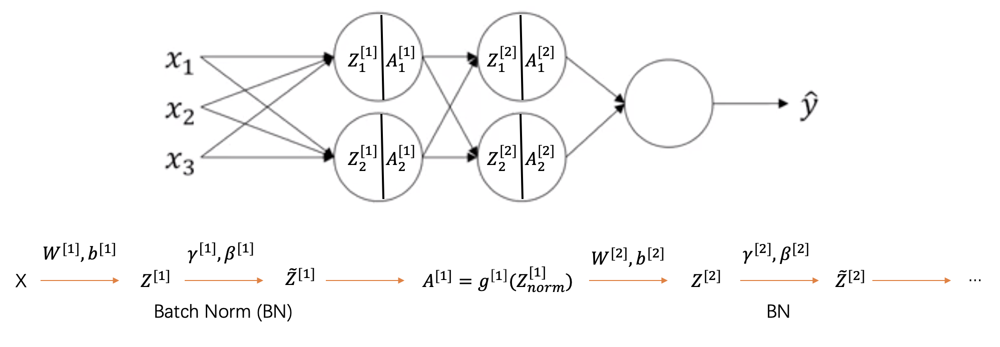

## Batch Normalization
$\bigstar$ BN 修正输入的偏移（internal covariate shift）

$\bigstar$ BN 在激活函数之前控制输出的均值和方差

$\bigstar$ BN 起到正则化作用的原因是，每一批次的数据根据均值和方差被缩放，这相当于给 $Z^{[l]}$ 增加了噪音。

$$
h_{i} = \gamma_{i} \frac{h_{i}-\mu_{i}}{\sqrt{\sigma^{2}}} + \beta_{i}, \quad  \frac{h_{i}-\mu_{i}}{\sqrt{\sigma^{2}}} \in \mathcal{N}(0,1)
$$

$\mu_{i}$ 和 $\sigma^{2}$ 从当前批次的数据获得。测试阶段使用的均值和方差是训练阶段的指数滑动平均。归一化输入有利于加速学习，例如，归一化 $a^{[2]}$ 可以使 $w^{[3]}$, $b^{[3]}$ 更快收敛。

$$
\begin{aligned}
& \mu = \frac{1}{m} \sum_{i}^{m} Z^{[l](i)}, \quad \sigma^{2} = \frac{1}{m} \sum_{i=1}^{m} (Z^{[l](i)} - \mu)^{2} \\
& Z_{\text{norm}}^{(i)} = \frac{Z^{[l](i)} - \mu}{\sqrt{\sigma^{2} + \epsilon}}
\end{aligned}
$$

但是，隐层单元并不总是正态分布，$\gamma_{i}$ 和 $\beta_{i}$ 是学习的参数，负责对矫正每一层的输入分布。

$$
\widetilde{Z}^{[l](i)} = \gamma Z_{\text{norm}}^{[l](i)} + \beta
$$

$$
\begin{aligned}
& 0 < \alpha < 1 \\
& \mu_{i} = \alpha \cdot \text{mean}_{batch} + (1-\alpha)\mu_{i} \\
& \sigma_{i}^{2} = \alpha \cdot \text{variance}_{batch} + (1-\alpha)\sigma_{i}^{2}
\end{aligned}
$$

反向传播

$$
\gamma^{[l]} = \gamma^{[l]} - \alpha d\gamma^{[l]}, \quad \beta^{[l]} = \beta^{[l]} - \alpha d \beta^{[l]}
$$

在神经网络加 BN 层

## Layer Normalization
LN 类似于 BN 都是对输入数据做归一化操作，不同点在于，BN 是对同一特征下的一批数据，而 LN 是同一条数据下不同特征做归一化。

## Normalizing inputs
归一化输入有利于梯度下降，损失函数更快收敛

$$
\begin{aligned}
& X = \frac{X - \mu}{\sigma} \\
& \mu = \frac{1}{m} \sum_{i=1}^{m} x^{i}, \quad \sigma^{2} = \frac{1}{m} \sum_{i=1}^{m} (x^{i} - \mu)^{2}
\end{aligned}
$$

假设输入的是一张图片，像素值归一化后

$$
x_{norm} = \frac{x}{255} - 0.5
$$
