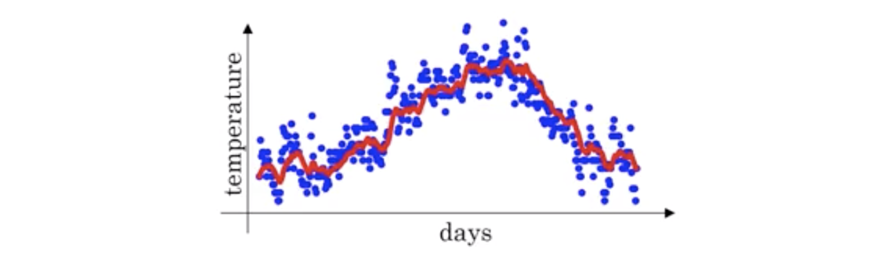

## 梯度下降
优化问题：$L(w)\rightarrow \min_{w}$，初始化参数：$w^{0}$。梯度向量：

$$
\nabla L(w^{0})=(\frac{\partial L(w^{0})}{\partial w_{1}}, \frac{\partial L(w^{0})}{\partial w_{2}}, ..., \frac{\partial L(w^{0})}{\partial w_{n}})
$$

参数更新

$$
w^{t+1} = w^{t} - \eta_{t}\nabla L(w^{t})
$$

收敛时停止更新：

$$
\left \| w^{t+1}-w^{t} \right \| < \epsilon
$$

梯度下降一次计算全部的样本，但内存有一定允许，这时使用**随机梯度下降（SGD）**更新。

$$
L(w) = \sum_{i=1}^{n}L(w; x_{i}, y_{i}) \rightarrow \min_{w}
$$

$i_{1}, i_{2}, ..., i_{m}$ = random indice between 1 ~ n

$g_{t} = \frac{1}{m}\sum_{j=1}^{m}\nabla L(w^{t};x_{i_{j}},y_{i_{j}})$

$w^{t+1} = w^{t} - \eta_{t}g_{t}$

if $\left\| w^{t+1}-w^{t} \right\| \leq \epsilon$, finish

## 指数加权平均
指数加权平均（Exponentially Weighted Averages）是一种数据平滑的方法。公式如下：

$$
\begin{aligned}
V_{t} &= \beta V_{t-1} + (1 - \beta) \theta_{t} \\
&= \beta^{t} V_{0} + \sum_{k = 1}^{t} \beta^{t - k} (1 - \beta) \theta_{k}
\end{aligned}
$$

例如，某地的温度变化

$$
\begin{aligned}
& \theta_{1} = 40^{\circ}\text{F} \\
& \theta_{2} = 49^{\circ}\text{F} \\
& \theta_{3} = 45^{\circ}\text{F} \\
& \vdots\\
& \theta_{180} = 60^{\circ}\text{F} \\
& \theta_{181} = 56^{\circ}\text{F} \\
& \vdots
\end{aligned}
$$

我们可以计算这一段时间的滑动平均值，用参数 $\beta$ = 0.9

$$
\begin{aligned}
& V_{0} = 0 \\
& V_{1} = \beta V_{0} + (1 - \beta) \theta_{1} = 0.9 \cdot 0 + 0.1 \cdot 40 = 4 \\
& V_{2} = \beta V_{1} + (1 - \beta) \theta_{2} = 0.9 \cdot 4 + 0.1 \cdot 49 = 8.5 \\
& V_{3} = \beta V_{2} + (1 - \beta) \theta_{3} = 0.9 \cdot 8.5 + 0.1 \cdot 45 = 12.15 \\
& \vdots
\end{aligned}
$$

$V_{t}$ 是 $\frac{1}{1 - \beta}$ 天内的滑动平均值，例如，$\beta$ = 0.9，$\frac{1}{1 - \beta} = \frac{1}{1 - 0.98} = 50$。

如果增大 $\beta$，滑动平均值曲线向右偏移；减小 $\beta$，曲线将会更加震荡。

因为在真实值和滑动平均值之间存在偏差，我们需要做一些修正 $\frac{V_{t}}{1 - \beta^{t}}$

## Momentum
$\bigstar$ 动量法用来消除震荡
$\bigstar$ $\beta$ 通常是 0.9. 
$\bigstar$ 在每一个mini-batch下，我们计算 dW 和 db，之后计算指数滑动平均，并更新 W 和 b。

$$
\begin{aligned}
& V_{dW} = \beta V_{dW} + (1 - \beta) dW \\
& V_{db} = \beta V_{db} + (1 - \beta) db \\
& W = W - \alpha V_{dW} \\
& b = b - \alpha V_{db}
\end{aligned}
$$

## RMSProp
$\bigstar$ RMSprop: Root Mean Square Propogation

$$
\begin{aligned}
& S_{dW} = \beta S_{dW} + (1 - \beta) (dW)^{2} \quad \text{where } (dW)^{2} \text{ are element-wise square} \\
& S_{db} = \beta S_{db} + (1 - \beta) (db)^{2} \quad \text{where } (db)^{2} \text{ are element-wise square} \\
& W = W - \alpha \frac{dW}{\sqrt{S_{dW}} + \epsilon} \\
& b = b - \alpha \frac{db}{\sqrt{S_{db}} + \epsilon}
\end{aligned}
$$

## Adam
$\bigstar$ Adam 是 Momentum 和 RMSprop 的结合
$\bigstar$ $\beta_{1}$ 是 0.9，$\beta_{2}$ 取 0.999，$\epsilon$ 取 $10^{-8}$

$$
\begin{aligned}
& V_{dW} = 0, \quad S_{dW} = 0, \quad V_{db} = 0, \quad S_{db} = 0 \\
& V_{dW} = \beta_{1} V_{dW} + (1 - \beta_{1}) dW, \quad V_{db} = \beta_{1} V_{db} + (1 - \beta_{1}) db \\
& S_{dW} = \beta_{2} S_{dW} + (1 - \beta_{2}) (dW)^{2}, \quad S_{db} = \beta_{2} S_{db} + (1 - \beta_{2}) (db)^{2} \\
& V_{dW}^{\text{corrected}} = \frac{V_{dW}}{1 - \beta_{1}^{t}}, \quad V_{db}^{\text{corrected}} = \frac{V_{db}}{1 - \beta_{1}^{t}} \\
& S_{dW}^{\text{corrected}} = \frac{S_{dW}}{1 - \beta_{2}^{t}}, \quad S_{db}^{\text{corrected}} = \frac{S_{db}}{1 - \beta_{2}^{t}} \\
& W = W - \alpha \frac{V_{dW}^{\text{corrected}}}{\sqrt{S_{dW}^{\text{corrected}}}+\epsilon}, \quad b = b - \alpha \frac{V_{db}^{\text{corrected}}}{\sqrt{S_{db}^{\text{corrected}}}+\epsilon}
\end{aligned}
$$

## 学习率衰减
$$
\begin{aligned}
& \alpha = \frac{\alpha_{0}}{ 1 + \text{DecayRate} * \text{EpochNumber}} \\
& \alpha =\alpha_{0}\cdot \text{DecayRate}^{\text{EpochNumber}} \\
& \alpha = \frac{k}{\sqrt{\text{EpochNumber}}} \cdot \alpha_{0}
\end{aligned}
$$
