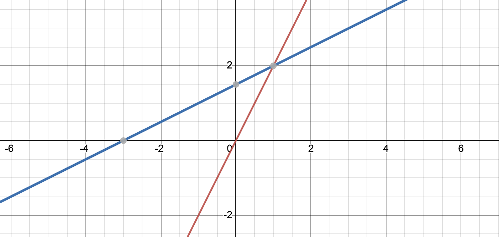
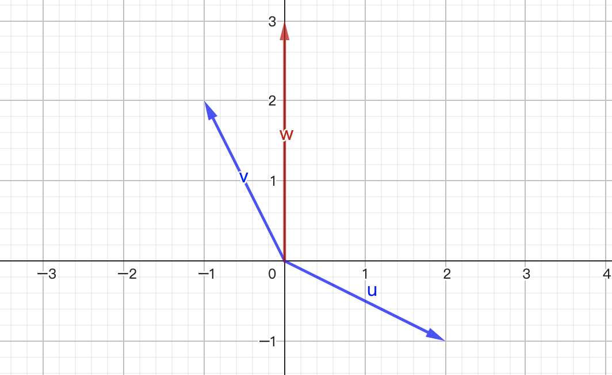
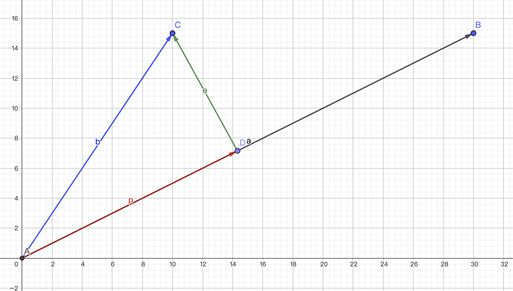
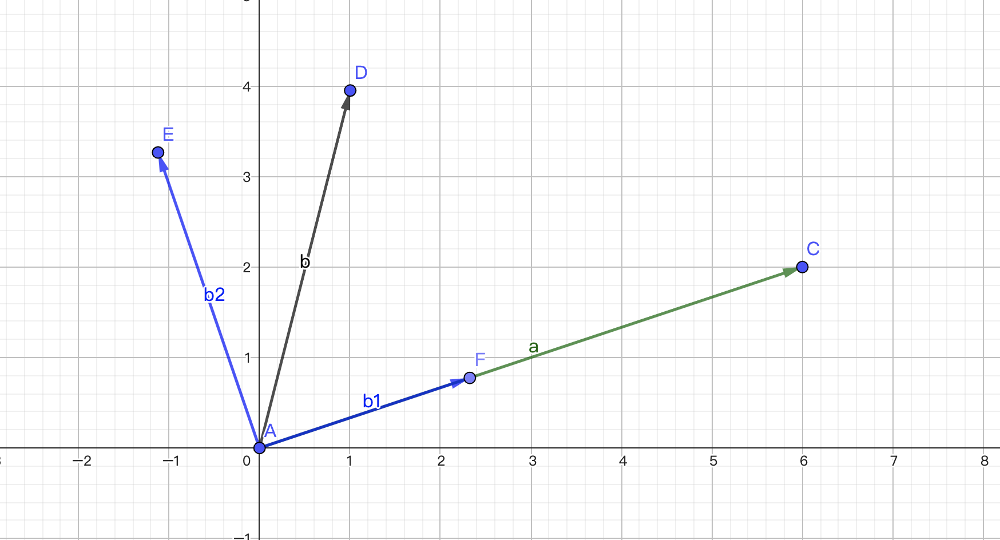
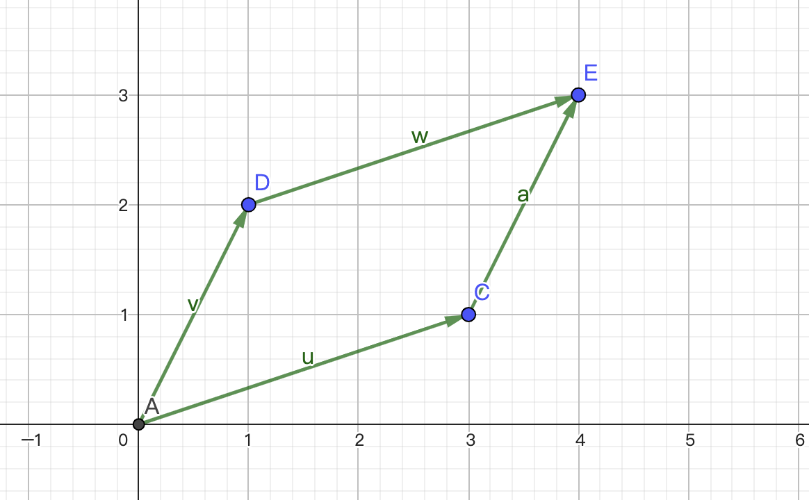

## 几何解释
考虑一组两元一次方程组

$$
\begin{cases}
2x-y=0 \\
-x+2y=3
\end{cases}
$$

如果将每一行看成一条直线，这个方程组可以被画出来

我们引入矩阵的表达方式

$$
\begin{matrix}
\begin{bmatrix}
2 & -1 \\
-1 & 2
\end{bmatrix} &
\begin{bmatrix}
x \\
y
\end{bmatrix} &
= &
\begin{bmatrix}
0 \\
3
\end{bmatrix} \\
A & X & = & b
\end{matrix}
$$

我们还可以将上述的一元二次方程组的求解过程看作是向量的线性组合

$$
x
\begin{bmatrix}
2 \\
-1
\end{bmatrix}
+
y
\begin{bmatrix}
-1 \\
2
\end{bmatrix}
=
\begin{bmatrix}
0 \\
3
\end{bmatrix}
$$

线性代数的几何解释是，列向量的线性组合（linear combination of columns）。

对于上述的方程组，我们可以求的结果

$$
\begin{cases}
x = 1 \\
y = 2
\end{cases}
$$

这里如果 x 和 y 可以取任意值，那么通过上面的组合，我们可以得到二维平面的任意向量，也就是说 Ax = b，无论 b 是何值，x 都有解。我们得到一个重要的发现，Ax 表示的是 A 在对应空间上的所有列向量的线性组合。

我们可以把矩阵乘法理解成列向量的线性组合，例如

$$
\begin{bmatrix}
2 & 5 \\
1 & 3
\end{bmatrix}
\begin{bmatrix}
1 \\
2
\end{bmatrix}
=
1
\begin{bmatrix}
2 \\
1
\end{bmatrix}
+
2
\begin{bmatrix}
5 \\
3
\end{bmatrix}
=
\begin{bmatrix}
12 \\
7
\end{bmatrix}
$$

## 消元法
考虑一个三元一次方程组

$$
\begin{cases}
x + 2y + z = 2 \\
3x + 8y + z = 12 \\
4y + z = 1
\end{cases}
$$

在求解多元一次方程组的时候，我们使用的正是消元法，它的思想是用方程关系，不断减少未知数的个数。将上述的方程组，转化成 Ax = b 的形式后，A 的矩阵表达

$$
A = 
\begin{bmatrix}
\boxed{\color{red} 1} & 2 & 1 \\
3 & \boxed{\color{red} 8} & 1 \\
0 & 4 & \boxed{\color{red} 1}
\end{bmatrix}
$$

方框圈中的叫做主元（pivot）。消元的过程如下，用第一行消除剩下行的第一个元

$$
\begin{bmatrix}
\boxed{\color{red} 1} & 2 & 1 \\
3 & \boxed{\color{red} 8} & 1 \\
0 & 4 & \boxed{\color{red} 1}
\end{bmatrix} \Leftrightarrow 
\begin{bmatrix}
\boxed{\color{red} 1} & 2 & 1 \\
0 & \boxed{\color{red} 2} & -2 \\
0 & 4 & \boxed{\color{red} 1}
\end{bmatrix}
$$

用第二行消除剩下行的第二个元

$$
\begin{bmatrix}
\boxed{\color{red} 1} & 2 & 1 \\
0 & \boxed{\color{red} 2} & -2 \\
0 & 4 & \boxed{\color{red} 1}
\end{bmatrix} \Leftrightarrow 
\begin{bmatrix}
\boxed{\color{red} 1} & 2 & 1 \\
0 & \boxed{\color{red} 2} & -2 \\
0 & 0 & \boxed{\color{red} 5}
\end{bmatrix} = U
$$

我们得到了上三角矩阵（upper-triangle）通常用 U 表示。继续用最后一行消除其他行

$$
\begin{bmatrix}
\boxed{\color{red} 1} & 2 & 1 \\
0 & \boxed{\color{red} 2} & -2 \\
0 & 0 & \boxed{\color{red} 5}
\end{bmatrix} \Leftrightarrow
\begin{bmatrix}
\boxed{\color{red} 1} & 2 & 0 \\
0 & \boxed{\color{red} 2} & 0 \\
0 & 0 & \boxed{\color{red} 5}
\end{bmatrix} \Leftrightarrow
\begin{bmatrix}
\boxed{\color{red} 1} & 0 & 0 \\
0 & \boxed{\color{red} 2} & 0 \\
0 & 0 & \boxed{\color{red} 5}
\end{bmatrix}
$$

消元的过程实际上是将 A 转化成 U。我们在找主元时，需要找到某个非零值作为主元，这个过程可以交换矩阵的两行。得到 U 之后，需要带回到原来的方程组，因为我们对 A 进行了线性变换，需要对 b 也要做同样的变换，因此引入 增广矩阵（augment matrix），即在矩阵 A 的右侧并入 b。

$$
\begin{bmatrix}
\boxed{\color{red} 1} & 2 & 1 & 2 \\
3 & \boxed{\color{red} 8} & 1 & 12 \\
0 & 4 & \boxed{\color{red} 1} & 2
\end{bmatrix}
$$

消元所做的一系列线性变换，同样作用到增广矩阵上。

$$
\begin{matrix}
\begin{bmatrix}
\boxed{\color{red} 1} & 2 & 1 & 2 \\
3 & \boxed{\color{red} 8} & 1 & 12 \\
0 & 4 & \boxed{\color{red} 1} & 2
\end{bmatrix} \\
\Updownarrow \\
\begin{bmatrix}
\boxed{\color{red} 1} & 2 & 1 & 2\\
0 & \boxed{\color{red} 2} & -2 & 6 \\
0 & 4 & \boxed{\color{red} 1} & 2
\end{bmatrix} \\
\Updownarrow \\
\begin{bmatrix}
\boxed{\color{red} 1} & 2 & 1 & 2 \\
0 & \boxed{\color{red} 2} & -2 & 6 \\
0 & 0 & \boxed{\color{red} 5} & -10
\end{bmatrix} \\
\Updownarrow \\
\begin{bmatrix}
\boxed{\color{red} 1} & 2 & 0 & 4 \\
0 & \boxed{\color{red} 2} & 0 & 2 \\
0 & 0 & \boxed{\color{red} 5} & -10
\end{bmatrix} \\
\Updownarrow \\
\begin{bmatrix}
\boxed{\color{red} 1} & 0 & 0 & 2 \\
0 & \boxed{\color{red} 2} & 0 & 2 \\
0 & 0 & \boxed{\color{red} 5} & -10
\end{bmatrix}
\end{matrix}
$$

最终的解

$$
\begin{cases}
x = 2 \\
y = 1 \\
z = -2
\end{cases}
$$

算法复杂度 $O(n^{3})$

$$
n^{2} + (n - 1)^{2} + \cdots + 1^{2} = \frac{n(n+1)(n+2)}{6}
$$

考虑两个矩阵相乘

$$
AB = 
\begin{bmatrix}
a_{11} & a_{12} \\
a_{21} & a_{22}
\end{bmatrix}
\begin{bmatrix}
b_{11} & b_{12} \\
b_{21} & b_{22}
\end{bmatrix} =
\begin{bmatrix}
a_{11}b_{11} + a_{12}b_{21} & a_{11}b_{12} + a_{12}b_{22} \\
a_{21}b_{11} + a_{22}b_{21} & a_{21}b_{12} + a_{22}b_{22}
\end{bmatrix} = C
$$

如果我们以 A 为基准点，右乘 B 得倒 C。C 有两列，每一列可以看成 B 对应的列右乘到 A 上 

$$
\begin{aligned}
AB &=
\begin{bmatrix}
a_{11} & a_{12} \\
a_{21} & a_{22}
\end{bmatrix}
\begin{bmatrix}
b_{11} & b_{12} \\
b_{21} & b_{22}
\end{bmatrix} \\
&=
\begin{bmatrix}
a_{11} & a_{12} \\
a_{21} & a_{22}
\end{bmatrix}
\begin{bmatrix}
B_{1} & B_{2} \\
\end{bmatrix}
\end{aligned}
$$

同样地，以 B 为基准点，C 相当于 B 左乘 A，即 A 的每一行左乘到 B 上。

$$
\begin{aligned}
AB &=
\begin{bmatrix}
a_{11} & a_{12} \\
a_{21} & a_{22}
\end{bmatrix}
\begin{bmatrix}
b_{11} & b_{12} \\
b_{21} & b_{22}
\end{bmatrix} \\
&=
\begin{bmatrix}
A_{1} \\
A_{2}
\end{bmatrix}
\begin{bmatrix}
b_{11} & b_{12} \\
b_{21} & b_{22}
\end{bmatrix}
\end{aligned}
$$

根据上面的发现，一个矩阵 A 通过消元得倒 U，本质上是一个行向量的线性变行，因此也就是一个不断左乘矩阵的过程。

$$
\begin{matrix}
\begin{bmatrix}
\boxed{\color{red} 1} & 2 & 1 \\
3 & \boxed{\color{red} 8} & 1 \\
0 & 4 & \boxed{\color{red} 1}
\end{bmatrix} \Leftrightarrow 
\begin{bmatrix}
\boxed{\color{red} 1} & 2 & 1 \\
0 & \boxed{\color{red} 2} & -2 \\
0 & 4 & \boxed{\color{red} 1}
\end{bmatrix} \\
\Downarrow \\
\begin{bmatrix}
1 & 0 & 0 \\
-3 & 1 & 0 \\
0 & 0 & 1
\end{bmatrix}
\begin{bmatrix}
\boxed{\color{red} 1} & 2 & 1 \\
3 & \boxed{\color{red} 8} & 1 \\
0 & 4 & \boxed{\color{red} 1}
\end{bmatrix} =
\begin{bmatrix}
\boxed{\color{red} 1} & 2 & 1 \\
0 & \boxed{\color{red} 2} & -2 \\
0 & 4 & \boxed{\color{red} 1}
\end{bmatrix}
\end{matrix}
$$

这里我们把左乘的矩阵成为初等变换矩阵（elementary matrix）或者消元矩阵（elimination matrix），用 E 表示。仔细观察会发现，A 的第一行和第三行没有变换，对应的 E 的第一行和第三行同单位矩阵（identity matrix），第二行减去第一行的三倍，所以 E 的第二行为 (-3, 1, 0)。总结来说，一个行向量 a（$1 \times n$）左乘到一个矩阵 B（$n \times m$），得到一个行向量 c（$1 \times m$），这个行向量 c 的值就是 B 的行向量线性组合的结果，线性组合的系数来自于 a。

如果涉及到行交换，我们需要用到置换矩阵（permutation matrix），用 P 表示。例如，交换两行需要将 P 左乘

$$
\begin{bmatrix}
0 & 1 \\
1 & 0
\end{bmatrix}
\begin{bmatrix}
a & b \\
c & d
\end{bmatrix} =
\begin{bmatrix}
c & d \\
a & b
\end{bmatrix}
$$

交换两列需要将 P 右乘到矩阵上

$$
\begin{bmatrix}
a & b \\
c & d
\end{bmatrix}
\begin{bmatrix}
0 & 1 \\
1 & 0
\end{bmatrix} =
\begin{bmatrix}
b & a \\
d & c
\end{bmatrix}
$$

我们可以发现，置换矩阵其实是单位矩阵的一种变体，如果我们想交换矩阵 A 的某两列（行），只要需要将单位矩阵对应两列（行）交换得到 P，然后右（左）乘到 A 上。对于一个 n 阶单位矩阵，总共有 n! 个置换矩阵，这里包含单位矩阵。例如，n = 3 时

$$
\begin{bmatrix}
1 & 0 & 0 \\
0 & 1 & 0 \\
0 & 0 & 1
\end{bmatrix}
\begin{bmatrix}
1 & 0 & 0 \\
0 & 0 & 1 \\
0 & 1 & 0
\end{bmatrix}
\begin{bmatrix}
0 & 1 & 0 \\
1 & 0 & 0 \\
0 & 0 & 1
\end{bmatrix}
\begin{bmatrix}
0 & 1 & 0 \\
0 & 0 & 1 \\
1 & 0 & 0
\end{bmatrix}
\begin{bmatrix}
0 & 0 & 1 \\
0 & 1 & 0 \\
1 & 0 & 0
\end{bmatrix}
\begin{bmatrix}
0 & 0 & 1 \\
1 & 0 & 0 \\
0 & 1 & 0
\end{bmatrix}
$$

置换矩阵有一个性质

$$
\begin{aligned}
& P^{-1} = P^{T} \\
& P^{T} P = I
\end{aligned}
$$

## 乘法
考虑两个矩阵 $A_{n \times m}$ 和 $B_{m \times p}$，两者的尺寸表现在其下标上，乘积后的矩阵为 $C_{n \times p}$，C 中的某个位置的元素结果遵循着如下规则

$$
C_{ij} = \sum_{k = 1}^{m} A_{ik}B_{kj}
$$

A 的列数和 B 的行数要保持一致。

如果我们将矩阵 B 还成一组列向量的组合，那么每一列和 A 想乘，便会得到 C 的每一列，这是矩阵乘法的另一种视角：**C 中的每一列都是 A 的列向量的线性组合，线性组合的系数来自于 B 对应的列。**

$$
A_{n \times m}
\begin{bmatrix}
\mid & \mid & \cdots & \mid \\
B_{1} & B_{2} & \cdots & B_{p}  \\
\mid & \mid & \cdots & \mid
\end{bmatrix}_{m \times p}
=
\begin{bmatrix}
\mid & \mid & \cdots & \mid \\
C_{1} & C_{2} & \cdots & C_{p}  \\
\mid & \mid & \cdots & \mid
\end{bmatrix}_{n \times p}
$$

同样地，如果我们将 A 看成一组行向量，那么 A 的每一行左乘到 B 上，就会得到 C 的对应行。这是行向量的视角：**C 中的每一行都是 B 的行向量的线性组合，线性组合的系数来自 B 对应的行**。

$$
\begin{bmatrix}
- & A_{1} & - \\
- & A_{2} & - \\
\vdots & \vdots & \vdots \\
- & A_{n} & -
\end{bmatrix}_{n \times m}
B_{m \times p}
=
\begin{bmatrix}
- & C_{1} & - \\
- & C_{2} & - \\
\vdots & \vdots & \vdots \\
- & C_{n} & -
\end{bmatrix}_{n \times p}
$$

结合列向量和行向量这两种视角，我们可以总结出矩阵乘积的核心是，矩阵 A 的列向量与矩阵 B 的行向量两两相乘，然后全部加起来。

$$
C = AB = \sum (\text{col of A})(\text{row of B})
$$

例如

$$
\begin{aligned}
C &= AB \\
&=
\begin{bmatrix}
2 & 7 \\
3 & 8 \\
4 & 9
\end{bmatrix}
\begin{bmatrix}
1 & 6 \\
0 & 0
\end{bmatrix} \\
&=
\begin{bmatrix}
2 \\
3 \\
4
\end{bmatrix}
\begin{bmatrix}
1 & 6
\end{bmatrix} +
\begin{bmatrix}
2 \\
3 \\
4
\end{bmatrix}
\begin{bmatrix}
0 & 0
\end{bmatrix} +
\begin{bmatrix}
7 \\
8 \\
9
\end{bmatrix}
\begin{bmatrix}
1 & 6
\end{bmatrix} +
\begin{bmatrix}
7 \\
8 \\
9
\end{bmatrix}
\begin{bmatrix}
0 & 0
\end{bmatrix} \\
&=
\begin{bmatrix}
2 + 0 + 7 + 0 & 12 + 0 + 42 + 0 \\
3 + 0 + 8 + 0 & 18 + 0 + 48 + 0 \\
4 + 0 + 9 + 0 & 24 + 0 + 54 + 0
\end{bmatrix} \\
&=
\begin{bmatrix}
9 & 54 \\
11 & 66 \\
13 & 78
\end{bmatrix}
\end{aligned}
$$

有些时候，较大矩阵间乘积计算较为复杂，我们可以对其进行「分块」（block）处理。

$$
\left[\begin{array} {c:c}
A_{1} & A_{2} \\ \hline 
A_{3} & A_{4}
\end{array} \right]
\left[\begin{array} {c:c}
B_{1} & B_{2} \\ \hline 
B_{3} & B_{4}
\end{array} \right] =
\left[\begin{array} {c:c}
A_{1}B_{1} + A_{2}B_{3} & A_{1}B_{2} + A_{2}B_{4} \\ \hline 
A_{3}B_{1} + A_{4}B_{3} & A_{3}B_{2} + A_{4}B_{4}
\end{array} \right]
$$

## 逆
假设我们有一个矩阵 A，我们想找到一个矩阵 B 使得 B A = I。B 就是 A 的逆矩阵（inverse），也写作 $A^{-1}$，例如

$$
A =
\begin{bmatrix}
1 & 0 & 0 \\
-3 & 1 & 0 \\
0 & 0 & 1
\end{bmatrix}
$$

逆矩阵左乘

$$
\begin{bmatrix}
1 & 0 & 0 \\
3 & 1 & 0 \\
0 & 0 & 1
\end{bmatrix}
\begin{bmatrix}
1 & 0 & 0 \\
-3 & 1 & 0 \\
0 & 0 & 1
\end{bmatrix} =
\begin{bmatrix}
1 & 0 & 0 \\
1 & 1 & 0 \\
0 & 0 & 1
\end{bmatrix}
$$

如果 A 是一个方阵（square matrix），即列数和行数是相等的。那么 A 的逆矩阵 $A^{-1}$，左逆和右逆时等价的。

$$
A^{-1} A = I = A A^{-1}
$$

如果有逆矩阵，我们称 A 时可逆的（invertible）或者是非奇异的（non-singular）。很自然地，我们会问什么时候，矩阵 A 是不可逆的？答案就是，如果我们能找打一个非零解 x，使得 Ax = 0（也就是 A 的线性组合等于 0），那么 A 就是不可逆（奇异）的。这里用反证法，假设 A 是可逆的，那么我们对 Ax 左乘逆矩阵 $A^{-1}$。

$$
\begin{matrix}
Ax = 0 \\
A^{-1} Ax = A^{-1} 0 = 0 \\
x = 0 \\
\end{matrix}
$$

与 x 非零解是矛盾的。

现在我们关心如何求一个矩阵的逆矩阵，例如

$$
A =
\begin{bmatrix}
1 & 3 \\
2 & 7
\end{bmatrix}
$$

根据逆矩阵的定义

$$
\begin{bmatrix}
1 & 3 \\
2 & 7
\end{bmatrix}
\begin{bmatrix}
a & b \\
c & d
\end{bmatrix} =
\begin{bmatrix}
1 & 0 \\
0 & 1
\end{bmatrix}
$$

只要能求出 a b c d 的值，A 的逆矩阵就可以知道。根据前面矩阵乘法的列向量视角，我们把逆矩阵拆分成多个列向量，也就是把矩阵乘法问题转化成多个 Ax = b 问题。

$$
\begin{aligned}
\begin{bmatrix}
1 & 3 \\
2 & 7
\end{bmatrix}
\begin{bmatrix}
a \\
c
\end{bmatrix} =
\begin{bmatrix}
1 \\
0
\end{bmatrix} \\
\begin{bmatrix}
1 & 3 \\
2 & 7
\end{bmatrix}
\begin{bmatrix}
b \\
d
\end{bmatrix} =
\begin{bmatrix}
0 \\
1
\end{bmatrix}
\end{aligned}
$$

这样就可以使用消元法。有没有一种可以同事处理多个方程组求解的方法？答案就是「高斯-若尔」（Gauss-Jordan）方法，将矩阵 A 和单位矩阵拼接成一起。

$$
[A, I] =
\left[\begin{array} {cc:cc}
1 & 3 & 1 & 0\\ 
2 & 7 & 0 & 1
\end{array} \right]
$$

对新矩阵进行消元

$$
\begin{matrix}
\left[\begin{array} {cc:cc}
1 & 3 & 1 & 0\\ 
2 & 7 & 0 & 1
\end{array} \right] \\
\Downarrow \\
\left[\begin{array} {cc:cc}
1 & 3 & 1 & 0\\ 
0 & 1 & -2 & 1
\end{array} \right] \\
\Downarrow \\
\left[\begin{array} {cc:cc}
1 & 0 & 7 & -3 \\ 
0 & 1 & -2 & 1
\end{array} \right]
\end{matrix}
$$

最终我们得到一个单位矩阵和一个矩阵的拼接，而这个矩阵就是 A 的逆矩阵。

$$
\left[\begin{array} {cc:cc}
1 & 0 & 7 & -3 \\ 
0 & 1 & -2 & 1
\end{array} \right] = [I, A^{-1}]
$$

消元的本质是行向量的线性组合，实现的方式是左乘一个初等矩阵 E，如下

$$
E [A, I] = [EA, E] = [I, A^{-1}]
$$

可知，EA = I，那么 E 就是 A 的逆矩阵。

## LU 分解
假设 A 时可逆的，那么

$$
A^{-1}A = I
$$

对两端进行转置

$$
(AA^{-1})^{T} = (A^{-1})^{T}A^{T} = I^{T} = I
$$

我们可以得出一个结论，A 的转置的逆矩阵等价于 A 的逆矩阵的转置

$$
(A^{T})^{-1} = (A^{-1})^{T}
$$

前面说到消元的本质是行向量的线性变换，对矩阵 A 左乘一个初等变换矩阵得到 U

$$
\begin{matrix}
\begin{bmatrix}
1 & 0 \\
-4 & 1
\end{bmatrix} &
\begin{bmatrix}
2 & 1 \\
8 & 7
\end{bmatrix} & = &
\begin{bmatrix}
2 & 1 \\
0 & 3
\end{bmatrix} \\
E & A & = & U
\end{matrix}
$$

我们将 E 挪到等式的右侧，便可以得到 A 的分解。

$$
\begin{matrix}
\begin{bmatrix}
2 & 1 \\
8 & 7
\end{bmatrix} & = &
\begin{bmatrix}
1 & 0 \\
4 & 1
\end{bmatrix} &
\begin{bmatrix}
2 & 1 \\
0 & 3
\end{bmatrix} & = &
\begin{bmatrix}
1 & 0 \\
4 & 1
\end{bmatrix} &
\begin{bmatrix}
2 & 0 \\
0 & 3
\end{bmatrix} &
\begin{bmatrix}
1 & \frac{1}{2} \\
0 & 1
\end{bmatrix} \\
A & = & L & U & = & L & D & U
\end{matrix}
$$

L 代表下三角（lower triangle），U 代表上三角（upper triangle），D 代表对角（diagonal）。如果我们考虑行交换，那么应该写成 PA = LU。

## 转置
矩阵的转置指的是将 A 的列向量用行向量的方式排列

$$
A^{T}_{ji} = A_{ij}
$$

例如

$$
\begin{aligned}
& A =
\begin{bmatrix}
1 & 3 \\
2 & 3 \\
4 & 1
\end{bmatrix} \\
& A^{T} = 
\begin{bmatrix}
1 & 2 & 4 \\
3 & 3 & 1
\end{bmatrix}
\end{aligned}
$$

如果矩阵的转置和自身相等，这样的矩阵成为「对称矩阵」（symmetric matrix）。

$$
A = A^{T} =
\begin{bmatrix}
3 & 1 & 7 \\
1 & 2 & 9 \\
7 & 9 & 4
\end{bmatrix}
$$

显然，对称矩阵一定是方阵。但是非对称矩阵也可以变成对称矩阵，方法是左乘它的转置。

$$
(A^{T}A)^{T} = A^{T}(A^{T})^{T} = A^{T}A
$$

## 向量空间
向量空间（vector space）可以看成是向量的一个集合，在这个集合里，我们可以进行线性运算（加乘 $\alpha v + \beta w$）。一个空间必须包含**原点**才能构成封闭空间。例如一个平面空间 $R^{2}$ 涵盖了所有 2 维的向量（只有两个实数分量）。第一象限并不能构成向量空间，因为它不是封闭的线性运算。

### 子空间
子空间（subspace）是原空间的自己。例如，实数平面 $R^{2}$ 是一个原空间，那么它的子空间有三个

1）实数平面本身（plane）

2）任何一条过远点的直线（line）

3）原点本身（point）

假设有两个子空间 S 和 T，那么两者的交集 $S \cap T$ 也是一个子空间。

### 列空间
下面考虑矩阵如何构成子空间，有一个矩阵如下

$$
A =
\begin{bmatrix}
1 & 1 & 2 \\
2 & 1 & 3 \\
3 & 1 & 4 \\
4 & 1 & 5
\end{bmatrix}
$$

A 的列向量属于 $R^{4}$，因为有 4 个实数分量。列向量的所有线性组合构成了一个子空间，我们称之为**列空间**（column space），用 C(A) 表示。从上面的例子可知，第三列向量是前两列的线性组合，那么它们所有的线性组合将会是一个平面。

这时我们会问一个问题，Ax = b 是否有解？

$$
\begin{matrix}
\begin{bmatrix}
1 & 1 & 2 \\
2 & 1 & 3 \\
3 & 1 & 4 \\
4 & 1 & 5
\end{bmatrix} &
\begin{bmatrix}
x_{1} \\
x_{2} \\
x_{3}
\end{bmatrix} & = &
\begin{bmatrix}
b_{1} \\
b_{2} \\
b_{3} \\
b_{4}
\end{bmatrix} \\
A & x & = & b
\end{matrix}
$$

这里有三个未知数，但是方程数目是 4，通常情况是无解的。但是根据前面总结，Ax 表示的 A 的列向量的线性组合，如果 b 是这个线性组合中的一员，也就是说 **b 属于 A 的列空间 C(A)**，那么方程组有解；反之，无解。

因为 A 的三个列向量是线性相关的，因此有一列是没有贡献的，我们可以去除任意一列。通常是最后一列，保留前面的线性无关的列，也称作主列。

### 零空间
零空间（null space）表示 Ax = 0 的所有解集合 x，记作 N(A)。从定义可以看出，零空间针对 x，而列空间针对 b。例如

$$
\begin{matrix}
\begin{bmatrix}
1 & 1 & 2 \\
2 & 1 & 3 \\
3 & 1 & 4 \\
4 & 1 & 5
\end{bmatrix} &
\begin{bmatrix}
x_{1} \\
x_{2} \\
x_{3}
\end{bmatrix} & = &
\begin{bmatrix}
0 \\
0 \\
0 \\
0
\end{bmatrix} \\
A & x & = & b
\end{matrix}
$$

这里零空间 $x \in R^{3}$，因为有三个未知数。我们可以解这个方程组

$$
x = c
\begin{bmatrix}
1 \\
1 \\
-1
\end{bmatrix}
$$

这里 c 可以取任意的实数，自然包含了全 0 解。可以看出，零空间实际上是一条直线。

下面我们来求解零空间，考虑这样的一个矩阵 A

$$
\begin{bmatrix}
1 & 2 & 2 & 2 \\
2 & 4 & 6 & 8 \\
3 & 6 & 8 & 10
\end{bmatrix}
$$

通过消元，转化成上三角矩阵 U 或者阶梯形式（echelon form）

$$
U =
\begin{bmatrix}
\boxed{\color{red} 1} & 2 & 2 & 2 \\
0 & 0 & \boxed{\color{red} 2} & 4 \\
0 & 0 & 0 & 0
\end{bmatrix}
$$

这个例子里，只有两个主元，主元的个数叫做矩阵的秩（rank）。主元所在的列叫主元列（pivot columns），其他的列叫做自由列（free columns）。这里「自由」指的是我们可以给对应的未知数（$x_{2}, x_{4}$）任意值。根据消元后系数，方程组如下

$$
\begin{cases}
x_{1} + 2x_{2} + 2x_{3} + 2x_{4} = 0 \\
2x_{4} + 4x_{4} = 0
\end{cases}
$$

我们不妨给两个自由变量 $x_{2} = 1, x_{4} = 0$

$$
x =
\begin{bmatrix}
-2 \\
1 \\
0 \\
0
\end{bmatrix}
$$

也可以赋另外一组值 $x_{2} = 0, x_{4} = 1$

$$
x =
\begin{bmatrix}
2 \\
0 \\
-2 \\
1
\end{bmatrix}
$$

这两个都称为特解，注意到有几个自由列，就有几个特解。最后**零空间的解为所有特解的线性组合**

$$
x = \alpha_{1}
\begin{bmatrix}
-2 \\
1 \\
0 \\
0
\end{bmatrix} + \alpha_{2}
\begin{bmatrix}
2 \\
0 \\
-2 \\
1
\end{bmatrix}
$$

如果一个矩阵 A 的尺寸是 $m \times n$，它的秩为 r，那么它的主元个数和主元列数为 r，自由列数为 n - r。

这里总结一下求解零空间的算法：

1）消元得到 U

2）确定主元列和自由列

3）给自由变量赋值求的特解

4）所有特解的线性组合即为最终解

上述的消元还可以更精炼，U 向上消元，并且将主元值变成 1，得到**简化行阶梯形式**（reduced row echelon form），用 R 表示。

$$
\begin{matrix}
U = \begin{bmatrix}
\boxed{\color{red} 1} & 2 & 2 & 2 \\
0 & 0 & \boxed{\color{red} 2} & 4 \\
0 & 0 & 0 & 0
\end{bmatrix} \\
\Downarrow \\
\begin{bmatrix}
\boxed{\color{red} 1} & 2 & 0 & -2 \\
0 & 0 & \boxed{\color{red} 2} & 4 \\
0 & 0 & 0 & 0
\end{bmatrix} \\
\Downarrow \\
R = \begin{bmatrix}
\boxed{\color{red} 1} & 2 & 0 & -2 \\
0 & 0 & \boxed{\color{red} 1} & 2 \\
0 & 0 & 0 & 0
\end{bmatrix}
\end{matrix}
$$

这里为什么可以将主元值变成 1 的原因是 Ax = 0 无需考虑 b 的大小。如果我们将 R 中的主列全部排到左边，自由列放到右边

$$
R = 
\begin{bmatrix}
\boxed{\color{red} 1} & 2 & 0 & -2 \\
0 & 0 & \boxed{\color{red} 1} & 2 \\
0 & 0 & 0 & 0
\end{bmatrix} =
\left[\begin{array} {cc:cc}
\boxed{\color{red} 1} & 0 & 2 & -2 \\
0 & \boxed{\color{red} 1} & 0 & 2 \\ 
\hdashline
0 & 0 & 0 & 0
\end{array} \right] =
\left[\begin{array} {c:c}
I & F \\ 
\hdashline
0 & 0
\end{array} \right]
$$

F 块内的值刚好是特解中主元变量对应的值的相反数，这里很好理解，因为我们给自由变量特定的值，解出来的主元变量值一定是自由变量的系数相反数。按照这个方法，最后解的形式为

$$
x =
\begin{bmatrix}
-F \\
I
\end{bmatrix}
$$

$$
\begin{bmatrix}
I & F
\end{bmatrix}
\begin{bmatrix}
x_{\text{pivot}} \\
x_{\text{free}}
\end{bmatrix} = I x_{\text{pivot}} + F x_{\text{free}} = 0
$$

## 完整解
考虑求解 Ax = b 样例如下

$$
\begin{bmatrix}
1 & 2 & 2 & 2 \\
2 & 4 & 6 & 8 \\
3 & 6 & 8 & 10
\end{bmatrix}
\begin{bmatrix}
x_{1} \\
x_{2} \\
x_{3} \\
x_{4}
\end{bmatrix} =
\begin{bmatrix}
b_{1} \\
b_{2} \\
b_{3}
\end{bmatrix}
$$

我们首先需要确定可解行（solvability），即 b 满足什么条件方程组有解。根据前面的总结，b 必须在 A 的列空间里，对增广矩阵进行消元

$$
\left[ \begin{array} {cccc:c}
1 & 2 & 2 & 2 & b_{1} \\
2 & 4 & 6 & 8 & b_{2} \\
3 & 6 & 8 & 10 & b_{3}
\end{array} \right] \Leftrightarrow
\left[ \begin{array} {cccc:c}
1 & 2 & 2 & 2 & b_{1} \\
0 & 0 & 2 & 4 & b_{2} - 2b_{1} \\
0 & 0 & 0 & 0 & b_{3} - b_{2} - b_{1}
\end{array} \right]
$$

可知增管矩阵的最后一行必须要全为 0 才有解，即

$$
b_{3} - b_{2} - b_{1} = 0
$$

总结一下，如果 A 的行向量线性组合产生了 0 行向量，那么 b 对应的线性组合也要产生 0，才会有解。

假设 Ax = b 是可解的，如下

$$
\begin{bmatrix}
1 & 2 & 2 & 2 \\
2 & 4 & 6 & 8 \\
3 & 6 & 8 & 10
\end{bmatrix}
\begin{bmatrix}
x_{1} \\
x_{2} \\
x_{3} \\
x_{4}
\end{bmatrix} =
\begin{bmatrix}
1 \\
5 \\
6
\end{bmatrix}
$$

求解的方法是特解 + 通解

1）特解：让所有的自由变量置成 0，求出主元变量的解，对于上例而言，$x_{2}$ 和 $x_{4}$ 是自由变量，置成 0。

$$
\begin{cases}
x_{1} + 2 x_{3} = 1 \\
2 x_{3} = 3
\end{cases}
$$

特解为

$$
x_{\text{particular}} =
\begin{bmatrix}
-2 \\
0 \\
3 / 2 \\
0
\end{bmatrix}
$$

2）通解，其实是零空间的解，即 $A x_{\text{null space}} = 0$

$$
x_{n} = c_{1}
\begin{bmatrix}
-2 \\
1 \\
0 \\
0
\end{bmatrix} + c_{2}
\begin{bmatrix}
2 \\
0 \\
-2 \\
1
\end{bmatrix}
$$

而最终完整的解为二者之和

$$
x_{c} = x_{p} + x_{n} =
\begin{bmatrix}
-2 \\
0 \\
3 / 2 \\
0
\end{bmatrix} +
c_{1}
\begin{bmatrix}
-2 \\
1 \\
0 \\
0
\end{bmatrix} + c_{2}
\begin{bmatrix}
2 \\
0 \\
-2 \\
1
\end{bmatrix}
$$

原因如下

$$
\begin{cases}
A x_{p} = b \\
A x_{n} = 0
\end{cases} \Leftrightarrow
A(x_{p} + x_{n}) = b
$$

### 秩与解的关系
假设 A 是一个 $m \times n$ 的矩阵，它的秩为 r，那么 r 与 m 和 n 的数量关系如下

$$
\begin{matrix}
r \leq m \\
r \leq n
\end{matrix}
$$

1）列满秩代表 r = n，这时 n 个主元变量，0 个自由变量，零空间里只有零向量。例如

$$
\begin{bmatrix}
1 & 3 \\
2 & 1 \\
6 & 1 \\
5 & 1
\end{bmatrix} \Leftrightarrow
\begin{bmatrix}
1 & 3 \\
0 & -5 \\
0 & 0 \\
0 & 0
\end{bmatrix}
$$

b 的后两行不为 0 时，Ax = b 无解；反之，有唯一解。表面上时 4 个方程，但在有解的情况下，只有 2 个有效的方程或者叫线性无关方程。如果将 U 转化成 R（简化行阶梯形式）形如

$$
R =
\begin{bmatrix}
I \\
0
\end{bmatrix}
$$

2）行满秩代表 r = m，消元时不会出现零向量行，因此对任意的 b 有解。m 个主元变量，n - m 个自由变量。例如

$$
\begin{bmatrix}
1 & 2 & 6 & 5 \\
3 & 1 & 1 & 1
\end{bmatrix} \Leftrightarrow
\begin{bmatrix}
1 & 2 & 6 & 5 \\
0 & -5 & -17 & -14
\end{bmatrix}
$$

如果将 U 转化成 R 形如

$$
R =
\begin{bmatrix}
I & F
\end{bmatrix}
$$

这里不一定全部的主元列在左侧，主元列和自由列交错也是可能的。

3）列满秩且行满秩代表 r = n = m，此时矩阵时方阵，并且时可逆的

$$
\begin{bmatrix}
1 & 2 \\
3 & 1
\end{bmatrix}
$$

如果将 U 转化成 R 形如

$$
R =
\begin{bmatrix}
I
\end{bmatrix}
$$

4）列和行均不满秩，即 r < m 且 r < n，此时 R 的形式

$$
R =
\begin{bmatrix}
I & F \\
0 & 0
\end{bmatrix}
$$

此时有 0 个解或者 $\infty$ 个解

总结如下

| 秩与行列数的关系 | 主元变量个数 | 自由变量个数 | 零空间 N(A) | Ax = b 的解个数 | Ax = b 的解（如果有） |
| :----: | :----: | :----: | :----: | :----: | :----: |
| 列满秩（r = n < m） | n | 0 | 只有零向量 | 0 或者 1 | $x_{c} = x_{p}$ |
| 行满秩（r = m < n） | m | n - m | 零向量和自由变量对应的向量 | $\infty$ | $x_{c} = x_{p} + x_{n}$ |
| 列满秩且行满秩（r = n = m） | r | 0 | 零向量 | 1 | $x_{c} = x_{p}$ |
| 列不满秩且行不满秩（r < n, r < m） | r | n - r | 零向量和自由变量对应的向量 | 0 或者 $\infty$ | $x_{c} = x_{p} + x_{n}$ |

## 线性相关
线性相关（linear dependence）指的是一组向量是否通过某种线性组合得倒零向量。如果有非零的组合，即向量的系数至少一个不为 0，则称之为线性相关；反之称之为线性独立（independence）。例如，下面三个向量

$$
c_{1}\begin{bmatrix}
2 \\
1
\end{bmatrix} + c_{2}
\begin{bmatrix}
1 \\
2
\end{bmatrix} + c_{3}
\begin{bmatrix}
3 \\
3
\end{bmatrix} =
\begin{bmatrix}
2 & 1 & 3 \\
1 & 2 & 3
\end{bmatrix}
\begin{bmatrix}
1 \\
1 \\
-1
\end{bmatrix} =
\begin{bmatrix}
0 \\
0
\end{bmatrix}
$$

我们能找到一组非 0 的系数 c，使得 Ac = 0，因此，这个三个向量是线性相关。我们会发现，这个三个向量构成一个矩阵，那么问题转化成 Ax = 0 是否有解。根据前面的结论，**如果零空间 N(A) 有非零向量（zero vector），那么 Ax = 0 有解，也就是说 A 的列向量线性相关**。同理，零空间只有零向量，那么 A 的列向量线性无关。

### 基
如果给定一组向量，那么我们可以对这一组向量做线性组合，所有的组合结果「生成」了一个空间 S。换句话说，S 包含了这一组向量的所有的线性组合。这里引出了**基**（basis）的概念：基是一组**线性无关**的向量，通过线性组合可以**生成**这个空间。例如，在 $R^{3}$ 实空间里的一组基

$$
\begin{bmatrix}
1 \\
0 \\
0
\end{bmatrix},
\begin{bmatrix}
0 \\
1 \\
0
\end{bmatrix},
\begin{bmatrix}
0 \\
0 \\
1
\end{bmatrix}
$$

这里如果只有两个向量能不能构成一组基呢？答案是否定的，因此，两个向量不能生成 $R^{3}$，只能生成一个平面。此外，一个空间下，基并非唯一，我们还可以找出其他的基

$$
\begin{bmatrix}
1 \\
1 \\
2
\end{bmatrix},
\begin{bmatrix}
2 \\
2 \\
5
\end{bmatrix},
\begin{bmatrix}
3 \\
7 \\
8
\end{bmatrix}
$$

$R^{n}$ 的空间需要 n 个线性独立的向量，它们构成了方阵 A，因此秩为 n，所有 A 是可逆的。

### 维数
空间的所有基含有相同个数的列向量，我们将这个数目称作为空间的维数（dimension）。

### 秩与维数的关系
假设有一个列空间 C(A)

$$
\begin{bmatrix}
1 & 2 & 3 & 1 \\
1 & 1 & 2 & 1 \\
1 & 2 & 3 & 1
\end{bmatrix}
$$

首先，列向量有三个元素，因此表示的是 $R^{3}$ 空间；其次，4 个列向量线性相关，通过消元可知有 2 个主元列和 2 个自由列，矩阵的秩序为 2，维数是 2；然后，零空间 N(A) 有 2 个特解；最后列空间的前两个列向量可以构成一组基，零空间的两个特解也可以构成零空间的基。

$$
x_{n} = c_{1}
\begin{bmatrix}
-1 \\
-1 \\
1 \\
0
\end{bmatrix} + c_{2}
\begin{bmatrix}
-1 \\
0 \\
0 \\
1
\end{bmatrix}
$$

这里我们得到了两组数量关系

$$
\begin{aligned}
& \text{rank}(A) = \#(\text{主元列}) = \text{dim C}(A) = r \\
& \text{dim N}(A) = \#(\text{自由列}) = n - r
\end{aligned}
$$

### 4 个基本空间
假设有矩阵 $A_{m \times n}$，4 个基本的空间如下

1）列空间 $C(A) \in R^{m}$

2）零空间 $N(A) \in R^{n}$

3）行空间 $R(A) = C(A^{T}) \in R^{n}$，A 的行空间等价于 $A^{T}$ 的列空间

4）左零空间 $N(A^{T}) \in R^{m}$，「左」来自于左乘

$$
(Ax)^{T} = 0^{T} = x^{T} A^{T}
$$

| 基本空间 | 所属空间 | 维数/主元列数 |
| :----: | :----: | :----: |
| $C(A)$ | $R^{m}$ | r |
| $N(A^{T})$ | $R^{m}$ | m - r |
| $C(A^{T})$ | $R^{n}$ | r |
| $N(A)$ | $R^{n}$ | n - r |

注意到列空间 $C(A)$ 和左零空间 $N(A^{T})$ 隶属同空间，并且它们的维数之和是所属空间的维数，此外这两个空间是垂直的。行空间和零空间同理。

## 正交
正交向量（orthogonal vectors）意味着两个向量是垂直的（perpendicular），或者两者的内积为 0。

$$
x^{T} y = 0
$$

零向量与任何向量正交。

如果我们将向量推广到子空间，即两个子空间是正交的，意味着，两个子空间内的任意向量是正交的。

$$
x^{T} y = 0, \forall x \in S, \forall y \in T \Leftrightarrow S \perp T
$$

在 4 个基本空间一节里，我们说零空间和行空间是正交的，原因如下

$$
\begin{matrix}
\begin{bmatrix}
\cdots & \text{row 1 of A} & \cdots \\
\cdots & \text{row 2 of A} & \cdots \\
\vdots & \vdots & \vdots \\
\cdots & \text{row m of A} & \cdots
\end{bmatrix} &
\begin{bmatrix}
x
\end{bmatrix} & = &
\begin{bmatrix}
0 \\
0 \\
\vdots \\
0
\end{bmatrix} \\
A & x & = & 0 
\end{matrix}
$$

这里假设零空间有非零向量，那么 A 的每一行与 x 相乘，结果都是 0，因此 A 的行空间与零空间是正交的。更具体地，这两个子空间的维数和等于原空间 $R^{n}$ 的维数。例如，在三维空间里，行空间的维数是 2，那么零空间的维数为 1。列空间和左零空间也是同样的道理。

我们前面知道任意一个矩阵 A，左乘它的转置，可以得到一个对称矩阵

$$
(A^{T})_{n \times m}A_{m \times n} = (A^{T}A)_{n \times n}
$$

但是 $A^{T}A$ 并一定可逆，反例如下

$$
\begin{bmatrix}
1 & 1 & 1 \\
3 & 3 & 3
\end{bmatrix}
\begin{bmatrix}
1 & 3 \\
1 & 3 \\
1 & 3
\end{bmatrix} =
\begin{bmatrix}
3 & 9 \\
9 & 27
\end{bmatrix}
$$

这里我们得到两个关系

$$
\begin{aligned}
& \text{N}(A^{T}A) = \text{N}(A) \\
& \text{rank}(A^{T}A) = \text{rank}(A)
\end{aligned}
$$

所以 $A^{T}A$ 可逆的充要条件是 A 的列向量线性无关。

### 投影
投影（projection）指的是一个向量 b 在另一个向量 a 的反向上的分量 p。如图

e 是误差分量，e 越小说明 b 和 a 越接近，e 与 a 是垂直关系。

$$
\overrightarrow{e} \perp \overrightarrow{a} \Leftrightarrow (\overrightarrow{b} - \overrightarrow{p}) \perp \overrightarrow{a}
$$

用内积表示

$$
a^{T}(b - p) = a^{T}(b - xa) = 0
$$

这里 x 是一个标量，a 和 b 是矢量。

$$
a^{T}xa = x a^{T} a = a^{T}b
$$

可以求 x

$$
x = \frac{a^{T}b}{a^{T}a}
$$

投影分量 p

$$
p = xa = \frac{a^{T}b}{a^{T}a} a = a \frac{a^{T}b}{a^{T}a} = \frac{aa^{T}}{a^{T}a} b = P b
$$

我们可以定义投影矩阵

$$
P = \frac{aa^{T}}{a^{T}a}
$$

分母 $a^{T}a$ 是一个标量，a 表示一个列向量。这个投影矩阵的性质如下：

1）rank(P) = 1

2）P 是一个对称矩阵 $P^{T} = P$

3）如果 b 对 a 做两次投影，得到的结果与投影一次的结果相同，即 $P^{2} = P$

为什么需要投影？有些时候 Ax = b 是无解的，但我们还想求解，只能退而求其次，求一个近似解，即 $A\hat{x} = p$，p 是 b 在列空间上的一个投影，而 $\hat{x}$ 是这个 x 的近似解。

因为是投影，所以垂直分量是 $b - p$，而 p 又是 A 的一个线性组合 $A\hat{x}$，利用内积关系

$$
A^{T}e = A^{T}(b - Ax) = 0
$$

如果这里是三维空间，上式表达的意思是 b 的垂直分量正交于 A 的列空间。这说明 e 属于 A 的零空间 N(A)

$$
\begin{aligned}
& e \perp C(A) \\
& e \in N(A)
\end{aligned}
$$

继续解上式

$$
\begin{matrix}
A^{T}b = A^{T}A \hat{x} \\
\Downarrow \\
\hat{x} = (A^{T}A)^{-1}A^{T}b
\end{matrix}
$$

b 在列空间上的分量 p

$$
p = A \hat{x} = A (A^{T}A)^{-1}A^{T}b = P b
$$

这里的 A 代表的任意维，如果 A 是向量，上式退化成

$$
p = a \hat{x} = a (a^{T}a)^{-1} a^{T}b = \frac{aa^{T}}{a^{T}a}b
$$

投影矩阵

$$
P = A (A^{T}A)^{-1}A^{T}
$$

因为 A 不一定是可逆的，所以不能写成 $A A^{-1} (A^{T})^{-1} A^{T} = I$。那如果 A 是可逆的，这意味着 A 零空间维数位 0，换句话说 b 是在列空间里，我们无需投影，原方程组有解。

如果 b 在列空间里，Pb = b，也就是无需投影；如果 b 正交于列空间，Pb = 0；如果 b 与列空间有夹脚，Pb 的结果是 b 在列空间上的投影。 

需要证明一个定理，**如果 A 的列向量线性无关的，那么 $A^{T}A$ 是可逆的**。如果 $A^{T}A$ 可逆，那么 $A^{T}A x = 0$，x 必须是零向量。等式两侧左乘 $x^{T}$

$$
x^{T} A^{T} A x = 0
$$

根据转置的性质

$$
(Ax)^{T} Ax = 0
$$

如果把 Ax 看成一个整体，那么 $(Ax)^{T} Ax$ 表示的是 Ax 的模，这意味着

$$
Ax = 0
$$

因为 A 的列向量是线性无关，可以推出 x = 0，这与我们的假设一直。

### 最小二乘法
最小二乘法（least sqaure）是一种线性回归的方法。如果我们有若干个点，我们需要绘制一条直线，尽可能的穿过这些点。例如，点 (1, 1)，(2, 2)，(3, 2)，假设直线为 y = C + D t

写出方程组

$$
\begin{cases}
C + D = 1 \\
C + 2D = 2 \\
C + 3D = 2
\end{cases}
$$

写成矩阵形式

$$
\begin{matrix}
\begin{bmatrix}
1 & 1 \\
1 & 2 \\
1 & 3
\end{bmatrix} &
\begin{bmatrix}
C \\
D
\end{bmatrix} & = &
\begin{bmatrix}
1 \\
2 \\
3
\end{bmatrix} \\
A & x & = & b
\end{matrix}
$$

根据前面的经验，这个方程组无解。我们现在先找到一组解，最接近 b。

$$
\min ||e||^{2} = \min ||Ax - b||^{2}
$$

问题转化成求解 $\hat{x}$

$$
\begin{matrix}
\begin{bmatrix}
1 & 1 & 1 \\
1 & 2 & 3\\
\end{bmatrix} &
\begin{bmatrix}
1 & 1 \\
1 & 2 \\
1 & 3
\end{bmatrix} &
\begin{bmatrix}
\hat{C} \\
\hat{D}
\end{bmatrix} & = &
\begin{bmatrix}
1 & 1 & 1 \\
1 & 2 & 3\\
\end{bmatrix} &
\begin{bmatrix}
1 \\
2 \\
3
\end{bmatrix} \\
A^{T} & A & x & = & A^{T} & b
\end{matrix}
$$

新的方程组

$$
\begin{bmatrix}
3 & 6 \\
6 & 14
\end{bmatrix}
\begin{bmatrix}
\hat{C} \\
\hat{D}
\end{bmatrix} =
\begin{bmatrix}
5 \\
11
\end{bmatrix} \Leftrightarrow
\begin{cases}
3 \hat{C} + 6 \hat{D} = 5 \\
6 \hat{C} + 14 \hat{D} = 11
\end{cases}
$$

我们也可以用微分的方法求解

$$
\begin{aligned}
\min ||e||^{2} &= \min ||Ax - b||^{2} \\
&= (\hat{C} + \hat{D} - 1)^{2} + (\hat{C} + 2\hat{D} - 2)^{2} + (\hat{C} + 3\hat{D} - 2)^{2}
\end{aligned}
$$

分别对两个分量求偏微分

$$
\begin{cases}
\hat{C} = 2/3 \\
\hat{D} = 1/2
\end{cases}
$$

直线方程

$$
y = \frac{2}{3} + \frac{1}{2} t
$$

### 正交基
正交基（orthogonal basis）指的是基向量之间相互正交，如果将基向量的模长变成单位长度，那么我们称之为标准正交基（orthonormal basis），用 q 表示。

$$
q_{i}^{T}q_{j} =
\begin{cases}
1, & i = j \\
0, & i \neq j
\end{cases}
$$

我们将这些正交基（列向量的形式）放入到矩阵中，这个矩阵叫做标准正交矩阵 Q

$$
\begin{bmatrix}
| & | & \cdots & | \\
q_{1} & q_{2} & \cdots & q_{n} \\
| & | & \cdots & |
\end{bmatrix}
$$

因为每一列与其他列相互正交，即

$$
Q^{T}Q =
\begin{bmatrix}
- & q_{1}^{T} & - \\
- & q_{2}^{T} & - \\
\vdots & \vdots & \vdots \\
- & q_{n}^{T} & -
\end{bmatrix}
\begin{bmatrix}
| & | & \cdots & | \\
q_{1} & q_{2} & \cdots & q_{n} \\
| & | & \cdots & |
\end{bmatrix} =
\begin{bmatrix}
1 & 0 & \cdots & 0 \\
0 & 1 & \cdots & 0 \\
\vdots & \vdots  & \ddots  & \vdots \\
0 & 0 & \cdots & 1
\end{bmatrix} = I
$$

一般情况，正交矩阵指的是方阵，Q 的转置等于 Q 的逆矩阵

$$
Q^{T} = Q^{-1}
$$

现在我们考虑的是如何正交化？答案是格拉姆-施密特方法（Graham-Schmidt）。这个方法的思想是固定前面的列向量，将后一个列向量投影到前面的列向量空间上，保留垂直的分量作为当前的正交向量，为了保持所有的向量是单位模长，需要归一化。如图

有两个向量 a 和 b，将 a 作为第一个正交向量 A，并对 A 归一化

$$
q_{1} = \frac{A}{||A||}
$$

b 对 A 做投影，垂直分量为第二个正交向量 B

$$
\begin{aligned}
& B = b - Pb = b - \frac{A A^{T}}{A^{T} A} b \\
& q_{2} = \frac{B}{||B||}
\end{aligned}
$$

验证可知 B 与 A 垂直

$$
A^{T} B = A^{T} (b - \frac{A A^{T}}{A^{T} A} b) = A^{T} b - A^{T} \frac{A A^{T}}{A^{T} A} b = 0
$$

假设此时还有一个向量 c，用同样的方法得到第三个正交向量

$$
\begin{aligned}
& C = c - P_{A}c - P_{B}c = c - \frac{A A^{T}}{A^{T} A} c - \frac{B B^{T}}{B^{T} B} c \\
& q_{3} = \frac{C}{||C||}
\end{aligned}
$$

利用 Q 可以对 A 进行分解

$$
A = Q R
$$

其中 Q 是正交矩阵，R 是非奇异上三角矩阵。例如 A 有两列线性无关向量，可以得到正交向量

$$
\begin{aligned}
A &= [a, b] \\
&= QR \\
&= [q_{1}, q_{2}]
\begin{bmatrix}
a^{T}q_{1} & b^{T}q_{1} \\
a^{T}q_{2} & b^{T}q_{2}
\end{bmatrix} \\
&= [q_{1}, q_{2}]
\begin{bmatrix}
a^{T}q_{1} & b^{T}q_{1} \\
0 & b^{T}q_{2}
\end{bmatrix}
\end{aligned}
$$

## 行列式
行列式（determinant）记作为 det(A) 用 |A| 表示，体现了方阵 A 的信息。行列式为 0 时，A 是奇异的。行列式的性质：

1）det(A) = 1

$$
\begin{vmatrix}
1 & 0 \\
0 & 1
\end{vmatrix} = 1
$$

2）交换两行或两列，改变行列式的符号

$$
\begin{vmatrix}
0 & 1 \\
1 & 0
\end{vmatrix} = -1
$$

3）行列式是一个线性函数：某一行同乘一个 t，等价于原式乘 t

$$
\begin{vmatrix}
ta & tb \\
c & d
\end{vmatrix} = t
\begin{vmatrix}
a & b \\
c & d
\end{vmatrix}
$$

同一行线性可加

$$
\begin{vmatrix}
a + a' & b + b' \\
c & d
\end{vmatrix} =
\begin{vmatrix}
a & b \\
c & d
\end{vmatrix} + 
\begin{vmatrix}
a' & b' \\
c & d
\end{vmatrix}
$$

整个行列式并不满足可加性 $\text{det}(A + B) \neq \text{det}(A) + \text{det}(B)$

4）如果 A 的两行（列）相等，那么 det(A) = 0，因为我们可以交换这两行（列），A 不变，但行列式符号改变。

5）某一行（列）加另一行（列）的 a 倍，行列式不变。

$$
\begin{vmatrix}
a & b \\
c & d
\end{vmatrix} =
\begin{vmatrix}
a & b \\
c + ia & d + ib
\end{vmatrix} =
\begin{vmatrix}
a & b \\
c & d
\end{vmatrix} + i
\begin{vmatrix}
a & b \\
a & b
\end{vmatrix}
$$

6）某一行（列）为 0，行列式为 0。

7）将 A 转化成上三角 U，行列式等于对角元素之积。

$$
\text{det}(U) =
\begin{vmatrix}
d_{1} & a_{12} & \cdots & a_{1n} \\
0 & d_{2} & \cdots & a_{2n} \\
\vdots & \vdots & \ddots & \vdots \\
0 & 0 & \cdots & d_{n}
\end{vmatrix}
$$

如果消元后，对角元素不为 0，那么通过向上消元将非对角元素消去

$$
\begin{aligned}
\text{det}(U) &=
\begin{vmatrix}
d_{1} & a_{12} & \cdots & a_{1n} \\
0 & d_{2} & \cdots &a_{2n} \\
\vdots & \vdots & \ddots & \vdots \\
0 & 0 & \cdots & d_{n}
\end{vmatrix} \\
&=
\begin{vmatrix}
d_{1} & 0 & \cdots & 0 \\
0 & d_{2} & \cdots & 0 \\
\vdots & \vdots & \ddots & \vdots \\
0 & 0 & \cdots & d_{n}
\end{vmatrix} \\
&= d_{1}
\begin{vmatrix}
1 & 0 & \cdots & 0 \\
0 & d_{2} & \cdots & 0 \\
\vdots & \vdots & \ddots & \vdots \\
0 & 0 & \cdots & d_{n}
\end{vmatrix} \\
&= d_{1} d_{2}
\begin{vmatrix}
1 & 0 & \cdots & 0 \\
0 & 1 & \cdots & 0 \\
\vdots & \vdots & \ddots & \vdots \\
0 & 0 & \cdots & d_{n}
\end{vmatrix} \\
&= \prod_{i = 1}^{n} d_{i}
\begin{vmatrix}
1 & 0 & \cdots & 0 \\
0 & 1 & \cdots & 0 \\
\vdots & \vdots & \ddots & \vdots \\
0 & 0 & \cdots & 1
\end{vmatrix}
\end{aligned}
$$

8）当 A 是奇异的，A 的行列式为 0；当 A 时可逆的，det(A) 不为 0。

9）A 和 B 乘积的行列式等于各自行列式的乘积

$$
\begin{aligned}
& \text{det}(AB) = \text{det}(A) \text{det}(B) \\
& \text{det}(A^{-1}) = \frac{1}{\text{det}(A)} \\
& \text{det}(A^{2}) = \text{det}(A)^{2} \\
& \text{det}(2A) = 2^{n} \text{det}(A)
\end{aligned}
$$

10）A 转置的行列式等于 A 的行列式

$$
\text{det}(A^{T}) = \text{det}(A)
$$

### 公式
我们从一个 2 阶行列式出发，利用上面的性质逐步分解

$$
\begin{aligned}
\begin{vmatrix}
a & b \\
c & d
\end{vmatrix} &=
\begin{vmatrix}
a & 0 \\
c & d
\end{vmatrix} +
\begin{vmatrix}
0 & b \\
c & d
\end{vmatrix} \\
&=
\begin{vmatrix}
a & 0 \\
c & 0
\end{vmatrix} +
\begin{vmatrix}
a & 0 \\
0 & d
\end{vmatrix} +
\begin{vmatrix}
0 & b \\
c & 0
\end{vmatrix} +
\begin{vmatrix}
0 & b \\
0 & d
\end{vmatrix} \\
&= \begin{vmatrix}
a & 0 \\
0 & d
\end{vmatrix} +
\begin{vmatrix}
0 & b \\
c & 0
\end{vmatrix} \\
&= \begin{vmatrix}
a & 0 \\
0 & d
\end{vmatrix} -
\begin{vmatrix}
c & 0 \\
0 & b
\end{vmatrix} \\
&= ad - bc
\end{aligned}
$$

这里我们可以得知，一个行列式按照上面的形式分解，最终每一行每一列只会保留一个元素。对 3 阶的行列式而言，分解如下

$$
\begin{aligned}
\begin{vmatrix}
a_{11} & a_{12} & a_{13} \\
a_{21} & a_{22} & a_{23} \\
a_{31} & a_{32} & a_{33}
\end{vmatrix} &=
\begin{vmatrix}
a_{11} & 0 & 0 \\
0 & a_{22} & 0 \\
0 & 0 & a_{33}
\end{vmatrix} +
\begin{vmatrix}
a_{11} & 0 & 0 \\
0 & 0 & a_{23} \\
0 & a_{32} & 0
\end{vmatrix} \\
& +
\begin{vmatrix}
0 & a_{12} & 0 \\
a_{21} & 0 & 0 \\
0 & 0 & a_{33}
\end{vmatrix} +
\begin{vmatrix}
0 & a_{12} & 0 \\
0 & 0 & a_{23} \\
a_{31} & 0 & 0
\end{vmatrix} \\
& +
\begin{vmatrix}
0 & 0 & a_{13} \\
a_{21} & 0 & 0 \\
0 & a_{32} & 0
\end{vmatrix} +
\begin{vmatrix}
0 & 0 & a_{13} \\
0 & a_{22} & 0 \\
a_{31} & 0 & 0
\end{vmatrix} \\
&= a_{11}a_{22}a_{33} - a_{11}a_{23}a_{32} - a_{12}a_{21}a_{33} \\
&+ a_{12}a_{23}a_{31} + a_{13}a_{21}a_{32} - a_{13}a_{22}a_{31}
\end{aligned}
$$

那么对于 n 阶的公式如下

$$
\det(A) = \sum_{n!} \pm a_{1\alpha}a_{2\beta}a_{3\gamma} \cdots a_{n \omega}
$$

其中，$(\alpha, \beta, \gamma, \cdots, \omega)$ 是 $(1, 2, 3, \cdots, n)$ 的一种排序，总共有 n! 中。

### 代数余子式
从 3 阶的行列式展开来看

$$
\begin{aligned}
\det(A) &= a_{11}(a_{22}a_{33} - a_{23}a_{32}) \\
&+ a_{12}(-a_{21}a_{33} + a_{31}a_{23}) \\
&+ a_{13}(a_{21}a_{32} - a_{22}a_{31})
\end{aligned}
$$

所以这是按照 A 的第一行展开。$a_{ij}$ 的代数余子式（cofactor）$C_{ij}$ 指的是一个 n-1 阶的行列式，这里将 n-1 阶是通过消除第 i 列和第 i 行。当 i+j 是偶数时，符号时正号码；反之，符号是负号。

$$
\begin{vmatrix}
+ & - & + & - & + & - \\
- & + & - & + & - & + \\
+ & - & + & - & + & - \\
- & + & - & + & - & +
\end{vmatrix}
$$

根据代数余子式，我们得到一种新的计算行列式的方法：A 的某一行（列）的元素分别乘以对应的代数余子式，再求和。

$$
\begin{aligned}
\det(A) &= a_{11}C_{11} + a_{12}C_{12} + \cdots + a_{1n}C_{1n} \\
&= \sum_{i=1}^{n} a_{1i}C_{1i} \\
&= \sum_{i=1}^{n} a_{2i}C_{2i} \\
&= \vdots \\
&= \sum_{i=1}^{n} a_{ni}C_{ni}
\end{aligned}
$$

如果把代数余子式按位置组合成新的矩阵 C，我们会得到一个等式

$$
\begin{aligned}
A C^{T} &= \det(A) I \\
&=
\begin{bmatrix}
a_{11} & a_{12} & \cdots & a_{1n} \\
a_{21} & a_{22} & \cdots & a_{2n} \\
\vdots & \vdots & \vdots & \vdots \\
a_{n1} & a_{n2} & \cdots & a_{nn}
\end{bmatrix}
\begin{bmatrix}
C_{11} & C_{21} & \cdots & a_{n1} \\
C_{12} & C_{22} & \cdots & a_{n2} \\
\vdots & \vdots & \vdots & \vdots \\
C_{1n} & C_{2n} & \cdots & a_{nn}
\end{bmatrix} \\
&=
\begin{bmatrix}
\det(A) & 0 & \cdots & 0 \\
0 & \det(A) & \cdots & 0 \\
\vdots & \vdots & \vdots & \vdots \\
0 & 0 & \cdots & \det(A)
\end{bmatrix} \\
&= \det(A) 
\begin{bmatrix}
1 & 0 & \cdots & 0 \\
0 & 1 & \cdots & 0 \\
\vdots & \vdots & \vdots & \vdots \\
0 & 0 & \cdots & 1
\end{bmatrix}
\end{aligned}
$$

这里需要注意**某一列（行）的元素与其余列（行）的代数余子式的乘积和为 0**。所以，A 的逆矩阵可以通过下式求得

$$
A^{-1} = \frac{1}{\det(A)} C^{T}
$$

有了逆矩阵计算方法，我们可以直接求解 Ax = b

$$
x = A^{-1} b = \frac{1}{\text{det}(A)} C^{T} b
$$

这个公式叫做「克莱姆法则」（Cramer's rule）。

### 体积
假设有一个 3 阶的行列式，每一列表示一个向量，可以看作是原点出发的边，因为是三位空间，所以表示的是长宽高。行列式代表的是体积

$$
\det(A) = \text{volume of box}
$$

如果是二维的，则表示平行四边形的面积

C 的坐标是 (3, 1)，D 的坐标是 (1, 2)，将这两个坐标放入方阵，计算行列式即可

$$
\det(A) =
\begin{vmatrix}
a & b \\
c & d 
\end{vmatrix} =
ad - bc = 6 - 1 = 5
$$

## 特征值和特征向量
矩阵就像一个函数，作用在 x 上，得到 Ax 表示对 x 做了映射，变换前后的两个向量方向通常不同，而我们关心的则是共线的情况。使得 Ax 与 x 共线的向量称之为特征向量（eigen vector），这里的共线表示同向、反向或者零向量。

$$
Ax = \lambda x
$$

$\lambda$ 则是特征值（eigen value）。

### 求解
现在考虑如何求解

$$
\begin{matrix}
Ax = \lambda x \\
\Downarrow \\
(A - \lambda I)x = 0
\end{matrix}
$$

如果存在 x，那么 $A - \lambda I$ 一定是奇异的；否则，x 只有零向量的解。

$$
\det(A - \lambda I) = 0
$$

例如

$$
A = 
\begin{bmatrix}
3 & 1 \\
1 & 3
\end{bmatrix}
$$

$$
\det(A - \lambda I) = 0 =
\begin{vmatrix}
3 - \lambda & 1 \\
1 & 3 - \lambda
\end{vmatrix} = (3 - \lambda)^{2} - 1
$$

解得

$$
\begin{cases}
\lambda_{1} = 2 \\
\lambda_{2} = 4
\end{cases}
$$

重新代回

$$
\begin{aligned}
& A - \lambda_{1} I =
\begin{bmatrix}
3 - 2 & 1 \\
1 & 3 - 2
\end{bmatrix} =
\begin{bmatrix}
1 & 1 \\
1 & 1
\end{bmatrix} \\
& A - \lambda_{2} I =
\begin{bmatrix}
3 - 4 & 1 \\
1 & 3 - 4
\end{bmatrix} =
\begin{bmatrix}
-1 & 1 \\
1 & -1
\end{bmatrix}
\end{aligned}
$$

特征向量

$$
\begin{aligned}
& x_{1} =
\begin{bmatrix}
1 \\
-1
\end{bmatrix} \\
& x_{2} =
\begin{bmatrix}
1 \\
1
\end{bmatrix}
\end{aligned}
$$

特征值与行列式的关系

$$
\det(A) = \prod_{i=1}^{n} \lambda_{i}
$$

### 迹
矩阵 A 对角线上的值的和叫做迹（trace）。

$$
\text{Tr}(A) = \sum_{i=1}^{n} a_{ii} = \sum_{i=1}^{n} \lambda_{i}
$$

### 对角化
假设 A 有 n 个线性无关的特征向量，并将它们以列向量的形式排列成矩阵 S。

$$
\begin{aligned}
AS &= A
\begin{bmatrix}
| & | & \cdots & | \\
x_{1} & x_{2} & \cdots & x_{n} \\
| & | & \cdots & |
\end{bmatrix} =
\begin{bmatrix}
| & | & \cdots & | \\
\lambda_{1}x_{1} & \lambda_{2}x_{2} & \cdots & \lambda_{n}x_{n} \\
| & | & \cdots & |
\end{bmatrix} \\
&=
\begin{bmatrix}
| & | & \cdots & | \\
x_{1} & x_{2} & \cdots & x_{n} \\
| & | & \cdots & |
\end{bmatrix}
\begin{bmatrix}
\lambda_{1} & 0 & \cdots & 0 \\
0 & \lambda_{2} & \cdots & 0 \\
\vdots & \vdots & \vdots & \vdots \\
0 & 0 & \cdots & \lambda_{n}
\end{bmatrix} \\
&= S \Lambda
\end{aligned}
$$

A 与 S 矩阵相乘，可以看作 A 与 S 的每一列分别相乘，这是乘法的列向量线性组合视角。$\Lambda$ 称之为特征值矩阵（eigenvalue matrix）。

$$
\begin{aligned}
& S^{-1}AS = \Lambda \\
& A = S \Lambda S^{-1}
\end{aligned}
$$

总结一下，**如果方阵 A 有 n 个线性无关的特征向量，它就可以被对角化**。矩阵的幂指数对应特征值的幂指数或特征矩阵的幂指数。

$$
\begin{aligned}
& A^{n} x = A^{n-1} Ax = A^{n-1} \lambda x = \lambda A^{n-1}x = \lambda^{n}x \\
& A^{n} = (S \Lambda S^{-1})^{n} = S \Lambda^{n} S^{-1}
\end{aligned}
$$

**一个矩阵 A 的特征值相互不同（无重复特征值），那么 A 一定有 n 个线性无关的特征向量（可对角化）。**

## 正定
矩阵的特殊性体现在特征值和特征向量上。对于实对称矩阵 $A^{T} = A$，所有的特征值是实数，特征向量是相互正价的。

$$
A = S \Lambda S^{-1} = Q \Lambda Q^{-1} = Q \Lambda Q^{T}
$$

正定矩阵（positive definite matrix）是实对称矩阵，所有的特征值是正值，所有的主元是正值，所有的子行列式（sub-determinant）是正值。

$$
x^{T} A x > 0
$$

## 相似
如果存在一个可逆矩阵 M，两个矩阵 A 和 B 是相似的，需要满足如下条件

$$
B = M^{-1} A M
$$

## 奇异值分解
奇异值分解（singular value decomposition，简称 SVD）

$$
A = U \Sigma V^{T}
$$

$\Sigma$ 是对角矩阵，U 和 V 是正交矩阵
