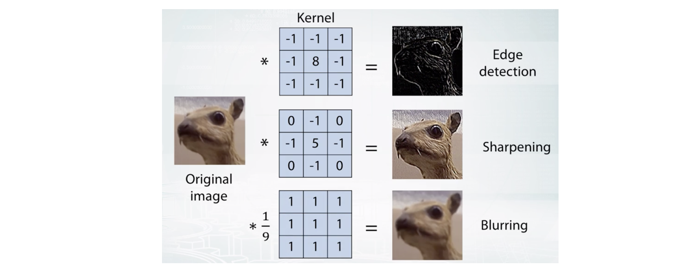
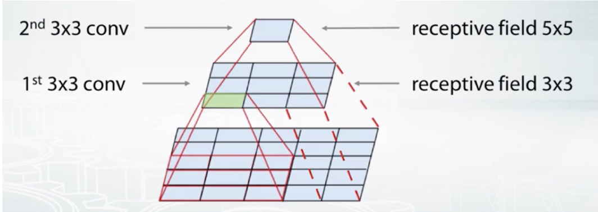

## 卷积

$$
\begin{bmatrix}
1 & 0 & 1 & 0 \\
0 & 1 & 1 & 0 \\
1 & 0 & 1 & 0 \\
1 & 0 & 1 & 1
\end{bmatrix} *
\begin{bmatrix}
1 & 2 \\
3 & 4
\end{bmatrix} =
\begin{bmatrix}
5 & 9 & 4 \\
5 & 7 & 4 \\
4 & 6 & 8
\end{bmatrix}
$$

不同卷积核的效果如下

$\bigstar$ 卷积的优点：平移不变性（Translational Equivariance）

$$
\begin{aligned}
&
\begin{bmatrix}
0 & 0 & 0 & 0 \\
0 & 0 & 0 & 0 \\
0 & 0 & 1 & 0 \\
0 & 0 & 0 & 1
\end{bmatrix} *
\begin{bmatrix}
1 & 0 \\
0 & 1
\end{bmatrix} =
\begin{bmatrix}
0 & 0 & 0 \\
0 & 1 & 0 \\
0 & 0 & 2
\end{bmatrix} \\
&
\begin{bmatrix}
1 & 0 & 0 & 0 \\
0 & 1 & 0 & 0 \\
0 & 0 & 0 & 0 \\
0 & 0 & 0 & 0
\end{bmatrix} *
\begin{bmatrix}
1 & 0 \\
0 & 1
\end{bmatrix} =
\begin{bmatrix}
2 & 0 & 0 \\
0 & 1 & 0 \\
0 & 0 & 0
\end{bmatrix}
\end{aligned}
$$

## 参数个数
假设我们的输入和输出大小都是 $300 \times 300$，如果用一个 $5 \times5 卷积核，只需要 26 个参数；如果用全连接层，需要 $8.1\times10^{9}$ 个参数。卷积层可以看作是一种特殊的全连接层，因为可以把感受野之外的参数看作是 0，卷积核的参数在不同神经元之间是共享的。

$C_{out}$ 个卷积核，尺寸是 $W \times H \times C_{in}$，W 和 H 分别是图片的宽和高，$C_{in}$ 是输入通道的个数（RGB通常是3），$C_{out}$ 是核的个数。所有的参数个数是 $(W_{k} \times H_{k} \times C_{in} + 1) \times C_{out}$

例如，我们有一个 10x10x3 的彩色图片，我们像堆两层卷积层，卷积核大小 3x3，两层个数分别是10 和 20，算上 bias，一共需要的参数个数是 

$$
(3 \times 3 \times 3 + 1) \times 10 + (3 \times 3 \times 10 + 1) \times 20 = 2100
$$

## Receptive field

堆积了 n 层卷积（核尺寸 k×k，步长为 1）层，感受野的边长是 nk-n+1。

## Edge detection
垂直方向

$$
\begin{bmatrix}
1 & 0 & -1\\
1 & 0 & -1\\
1 & 0 & -1
\end{bmatrix}
$$

水平方向

$$
\begin{bmatrix}
1 & 1 & 1\\
0 & 0 & 0\\
-1 & -1 & -1
\end{bmatrix}
$$

Sobel operator

$$
\begin{bmatrix}
1 & 0 & 1\\
2 & 0 & -2\\
1 & 0 & -1
\end{bmatrix}
$$

Sharp filter

$$
\begin{bmatrix}
3 & 0 & -3\\
10 & 0 & -10\\
3 & 0 & -3
\end{bmatrix}
$$

## Padding
"Valid": $n \times n$ * $f \times f$ $\rightarrow$ $(n - f +1) \times (n - f + 1)$

"same": 填充后的尺寸和输入尺寸相通

## Strided Convolutions

$$
(n \times n) * (f \times f) \rightarrow (\left \lfloor \frac{n + 2p - f}{s} + 1 \right \rfloor \times \left \lfloor \frac{n + 2p - f}{s} + 1 \right \rfloor)
$$

假如我们有一张 $7 \times 7$ 的图片，卷积核 $3 \times 3$，padding = 'valid'，stride = 2，那么输出的尺寸是

$$
(\frac{7 + 0 - 3}{2} + 1, \frac{7 + 0 - 3}{2} + 1) = (3, 3)
$$

一层卷积层，10 个核，尺寸 $3 \times 3 \times 3$，参数个数：$(3 \times 3 \times 3 + 1) \times 10 = 280$

卷积层 l

$$
f^{[l]} = \text{filter size}, \quad p^{[l]} = \text{padding}, \quad s^{[l]} = \text{stride}, \quad n_{c}^{[l]} = \text{number of filters}
$$

每一层过滤的尺寸

$$
f^{[l]} \times f^{[l]} \times n_{c}^{[l-1]}
$$

这一层的输入

$$
n_{H}^{[l-1]} \times n_{W}^{[l-1]} \times n_{c}^{[l-1]}
$$

这一层的输出

$$
n_{H}^{[l]} \times n_{W}^{[l]} \times n_{c}^{[l]}
$$

$$
n_{H}^{[l]} = \left \lfloor \frac{n_{H}^{[l-1]} +2p^{[l]} -f^{[l]}}{s^{[l]}} + 1 \right \rfloor, \quad n_{W}^{[l]} = \left \lfloor \frac{n_{W}^{[l-1]} +2p^{[l]} -f^{[l]}}{s^{[l]}} + 1 \right \rfloor
$$

激活函数

$$
A^{[l]} \rightarrow m \times n_{H}^{[l]} \times n_{W}^{[l]} \times n_{c}^{[l]}
$$

参数

$$
f^{[l]} \times f^{[l]} \times n_{c}^{[l-1]} \times n_{c}^{[l]}
$$

bias

$$
n_{c}^{[l]} \rightarrow (1, 1, 1, n_{c}^{[l]})
$$

输入大小 63x63x16，32 核，核尺寸 7x7，stride = 2，无 padding，输出尺寸 29x29x32

输入大小 15x15x8，“pad=2”，padding 后的输出尺寸 19x19x8

输入大小 63x63x16，32 核，核尺寸 7x7，stride = 1，padding 为 “same”，padding 为 3

输入大小 32x32x16，使用 max pooling 且 stride = 2，过滤大小为 2，输出尺寸 16x16x16

## 池化

$$
\begin{aligned}
&
\begin{bmatrix}
1 & 3 & 2 & 1\\
2 & 9 & 1 & 1\\
1 & 3 & 2 & 3\\
5 & 6 & 1 & 2
\end{bmatrix} \rightarrow
\begin{bmatrix}
9 & 2\\
6 & 3
\end{bmatrix} & \text{Max pooling} \\
&
\begin{bmatrix}
1 & 3 & 2 & 1\\
2 & 9 & 1 & 1\\
1 & 3 & 2 & 3\\
5 & 6 & 1 & 2
\end{bmatrix} \rightarrow
\begin{bmatrix}
\frac{15}{4} & \frac{5}{4}\\
\frac{15}{4} & 2
\end{bmatrix} & \text{Average pooling}
\end{aligned}
$$

$\bigstar$ 超参数：过滤大小，步长，池化类型
