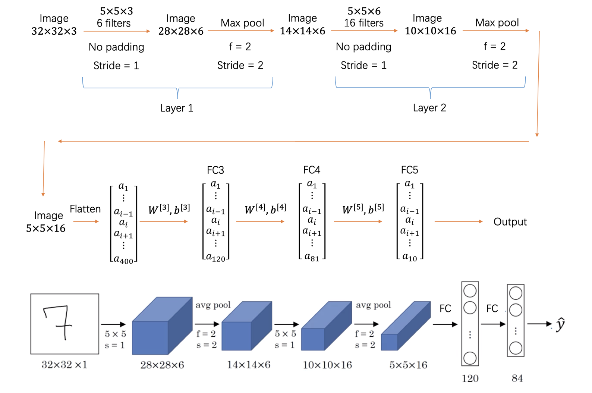
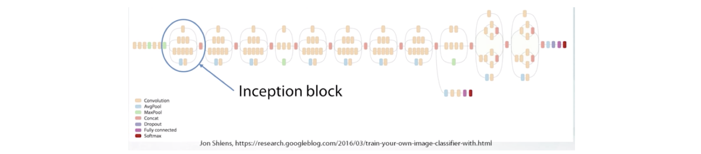

## 经典结构
### LeNet5
LeNet5（1998），第一个卷积神经网络。



| 层 | 维度 | 大小 | 参数量 |
| :----: | :----: | :----: | :----: |
| Input | (32, 32, 3) | 3072 | 0 |
| CONV1 (f=5, s=1) | (28, 28, 8) | 6272 | (5*5*3 + 1) * 8 = 608 |
| POOL1 | (14, 14, 8) | 1568 | 0 |
| CONV2 (f=5, s=1) | (10, 10, 16) | 1600 | (5*5*8 + 1) * 16 = 3216 |
| POOL2 | (5, 5, 16) | 400 | 0 |
| FC3 | (120, 1) | 120 | 400*120 + 120 = 48120 |
| FC4 | (84, 1) | 84 | 120*84 + 84 (not 1) = 10164 |
| Softmax | (10, 1) | 10 | 84*10 + 10 = 850 |

### AlexNet
AlexNet（2012）第一个深度卷积神经网络。Top5 误差从 26% 降到 15%。$11\times11$, $5\times5$, $3\times3$ 卷积核，max-pooling，dropout，data augmentation，ReLU activation，SGD with momentum，60 million 参数量。


### VGG
VGG（2015）类似于 AlexNet，仅仅 $3\times3$ 卷积核，但是多层。ImageNet Top5 误差 8%。


### InceptionV3
InceptionV3（2015）采用 GoogleNet 提出的 Inception block。ImageNet Top5 误差 5.6%。atch normalization, image distortion, RMSprop。



$1 \times 1$ 卷积核捕获输出通道的交互，减少了输入通道的数目但不损害模型质量，因为不同通道想依赖。

$$
\begin{bmatrix}
1 & 2 & 3 & 6 & 5 & 8 \\
3 & 5 & 5 & 1 & 3 & 4 \\
2 & 1 & 3 & 4 & 9 & 3 \\
4 & 7 & 8 & 5 & 7 & 9 \\
1 & 5 & 3 & 7 & 4 & 8 \\
5 & 4 & 9 & 8 & 3 & 5
\end{bmatrix} * 
\begin{bmatrix} 2 \end{bmatrix} =
\begin{bmatrix}
2 & 4 & 6 & 12 & 10 & 16 \\
6 & 10 & 10 & 2 & 6 & 8 \\
4 & 2 & 6 & 8 & 18 & 6 \\
8 & 14 & 16 & 10 & 14 & 18 \\
2 & 10 & 6 & 14 & 8 & 16 \\
10 & 8 & 18 & 16 & 6 & 10
\end{bmatrix}
$$


Basic Inception Block 


### ResNet
ResNet（2015）引入了残差连接（residual connections 或者 skip connections）。ImageNet Top5 误差 4.5%。152 层, 较少的 $7\times7$ 卷积层，大部份是 $3\times3$，batch normalization，max and average pooling。

残差连接指的是输出通道直接连接输入通道 x。


## 简单分类任务
### 手写数字识别
这里使用 MNIST 数据集。

```cpp
from matplotlib import pyplot as plt
%matplotlib inline
import tensorflow as tf
print("We're using TF", tf.__version__)
# building a model with keras
from tensorflow.keras.layers import Dense, Activation
from tensorflow.keras.models import Sequential
from tensorflow.keras.utils import to_categorical
from tensorflow.keras.datasets import mnist

# Load data and preprocess
(X_train, y_train), (X_test, y_test) = mnist.load_data()
X_train = X_train.reshape((60000, 28*28))/255.
X_test = X_test.reshape((10000, 28*28))/255.
y_train_oh = to_categorical(y_train, 10)
y_test_oh = to_categorical(y_test, 10)

# we still need to clear a graph though
tf.keras.backend.clear_session()

# it is a feed-forward network without loops like in RNN
model = Sequential()
# the first layer must specify the input shape (replacing placeholders)
model.add(Dense(256, input_shape=(784,)))
model.add(Activation('sigmoid'))
model.add(Dense(256))
model.add(Activation('sigmoid'))
model.add(Dense(10))
model.add(Activation('softmax'))
# you can look at all layers and parameter count
model.summary()
# now we "compile" the model specifying the loss and optimizer
model.compile(
    loss='categorical_crossentropy', # this is our cross-entropy
    optimizer='adam',
    metrics=['accuracy']  # report accuracy during training
)

# and now we can fit the model with model.fit()
# and we don't have to write loops and batching manually as in TensorFlow
history = model.fit(
    X_train, 
    y_train_oh,
    batch_size=512, 
    epochs=40,
    validation_data=(X_test, y_test_oh),
    verbose=0
)

def plot(loss_train, loss_test, accuracy_train, accuracy_test, EPOCHS):
    x = np.arange(EPOCHS)
    fig, (ax1, ax2)  = plt.subplots(1, 2, figsize=(20, 5))
    ax1.plot(x, loss_train, color='red', linewidth=1.0, linestyle='solid',
             label='train loss')
    ax1.plot(x, loss_test, color='green', linewidth=1.0, linestyle='solid',
             label='test loss')
    ax1.legend()
    ax1.set_title('Cross entropy loss')

    ax2.plot(x, accuracy_train, color='red', linewidth=1.0, linestyle='solid',
             label='accuracy train')
    ax2.plot(x, accuracy_test, color='green', linewidth=1.0, linestyle='solid',
             label='accuracy test')
    ax2.legend()
    ax2.set_title('Accuracy')

    plt.show()

plot(history.history['loss'], history.history['val_loss'],
     history.history['accuracy'], history.history['val_accuracy'],
     len(history.epoch))
```


## 语义分割

## 目标检测

## 自编码器
自编码器（Autoencoders）主要想法是从原始高纬分布中选取数据，映射到一个新空间中，新空间的数据尽可能准确地反映原空间的数据分布，即Decoder(Encoder(x)) ~ x。

以矩阵分解为例，最小化矩阵变化前后的 diff

$$
\left \| X - UV^{T} \right \| \rightarrow \min_{U, V}
$$


## GAN
GAN 对抗生成网络（Generative Adversarial Networks）。

对生成器（Generator）而言

$$
L_{G} = -\log(1 - \text{Disc}(\text{Gen}(\text{Seed})))
$$

对判别器（Discriminator）而言

$$
L_{D} = -\log(1 - \text{Disc}(\text{RealData})) - \log(\text{Disc}(\text{Gen}(\text{Seed})))
$$

训练过程：

1）随机初始化生成器和判别器的参数

2）训练判别器来区分真实图片和生成器输出的图片

3）训练生成器输出图片使判别器出错

4）重复步骤 2）和 3）
