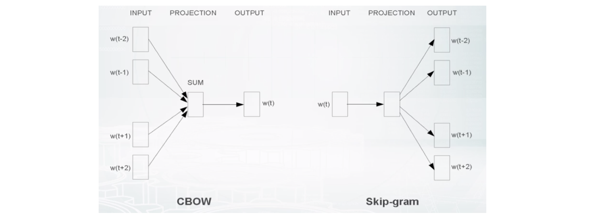

## Word2vec
词向量是一种将单词数字化表达的方法，即将单词空间投影到向量空间。Word2vec（Mikolov et al. 2013）是一种生成词向量的框架。

skip-gram（SG）：用中心词预测上下文词

Continuous Bag of Words（CBOW）：用上下文预测中心词

### 思路
1）一个大语料库

2）每一个单词可以被向量话

3）本文中，每一个词都会有中心词（center）和上下文（outside）

4）用 c 和 o 的词向量相似度来计算条件概率 P(o | c) 或者 P(c | o)

5）调整词向量，以达到最大概率

### 条件概率
对一条文本「我爱天安门」来说，如果给出中心词「天」，那么我想知道「爱」和「门」的条件概率是多少呢？

$$
P(o | c) = P(w_{t+j} | w_{t}) = P(\text{天} | \text{爱})
$$

这里就是用到给定中心词 c 来求上下文词 o 的条件概率。一般而言，上下文词处于中心的窗口内。如果依次遍历中心词（滑动窗口），即可求出所有的条件概率。

### 目标函数
一个固定的窗口长度 m，对每个位置，预测所有上下文词 o。使用极大似然估计（MLE）

$$
L(\theta) = \prod_{t \in [1, T]} \prod_{j \in [-m, 0) \bigcup_{}^{} (0,m]} P(w_{t+j} | w_{t}; \theta)
$$

对数损失函数

$$
J(\theta) = -\frac{1}{T} \log L(\theta) = -\frac{1}{T} \sum_{t \in [1, T]} \sum_{j \in [-m, 0) \bigcup_{}^{} (0,m]} \log P(w_{t+j} | w_{t}; \theta)
$$

最小化损失函数前，需要计算条件概率。对每一个词，我们设计两个词向量，$v_{w}$ 表示 w 是一个中心词时的向量，$u_{w}$ 表示 w 是一个上下文词的向量。

$$
P(o | c) = \frac{\exp(u_{o}^{T} v_{c})}{\sum_{w \in V}\exp(u_{w}^{T} v_{c})}
$$

这里 V 代表语料库的大小，$\theta$ 代表全部可学习的参数，每个词有两个向量。

$$
\theta =
\begin{bmatrix}
v_{1} \\
\vdots \\
v_{V} \\
u_{1} \\
\vdots \\
u_{V} \\
\end{bmatrix}
\in R^{2dV}
$$

### 梯度下降
对 $v_{c}$ 求导

$$
\begin{aligned}
\frac{\partial}{\partial v_{c}} \log \frac{\exp(u_{o}^{T}v_{c})}{\sum_{w=1}^{V}\exp(u_{w}^{T}v_{c})} &= \frac{\partial}{\partial v_{c}} [\log \exp(u_{o}^{T}v_{c}) - \log \sum_{w=1}^{V}\exp(u_{w}^{T}v_{c})] \\
&= \frac{\partial}{\partial v_{c}} u_{o}^{T}v_{c} - \frac{\partial}{\partial v_{c}} \log \sum_{w=1}^{V}\exp(u_{w}^{T}v_{c}) \\
&= u_{o} - \frac{1}{\sum_{w=1}^{V}\exp(u_{w}^{T}v_{c})} \sum_{w=1}^{V} \frac{\partial} {\partial v_{c}} \exp(u_{w}^{T}v_{c}) \\
&= u_{o} - \frac{1}{\sum_{w=1}^{V}\exp(u_{w}^{T}v_{c})} \sum_{w=1}^{V} \exp(u_{w}^{T}v_{c}) u_{w} \\
&= u_{o} - \sum_{w=1}^{V} \frac{\exp(u_{w}^{T}v_{c})}{\sum_{w=1}^{V}\exp(u_{w}^{T}v_{c})} u_{w} \\
&= u_{o} - \sum_{w=1}^{V} P(w | c) u_{w}
\end{aligned}
$$

$u_{o}$ 表示观察到的上下文词的向量，$\sum_{w=1}^{V} P(w | c) u_{w}$ 表示一个期望值，给出中心词后，所有文本次的加权平均。

对 $u_{o}$ 求导

$$
\begin{aligned}
\frac{\partial}{\partial u_{0}} \log \frac{\exp(u_{o}^{T}v_{c})}{\sum_{w=1}^{V}\exp(u_{w}^{T}v_{c})} &= \frac{\partial}{\partial u_{0}} [\log \exp(u_{o}^{T}v_{c}) - \log \sum_{w=1}^{V}\exp(u_{w}^{T}v_{c})] \\
&= \frac{\partial}{\partial u_{0}} u_{o}^{T}v_{c} - \frac{\partial}{\partial u_{0}} \log \sum_{w=1}^{V}\exp(u_{w}^{T}v_{c}) \\
&= v_{c} - \frac{1}{\sum_{w=1}^{V}\exp(u_{w}^{T}v_{c})} \frac{\partial}{\partial u_{0}} \exp(u_{o}^{T}v_{c}) \\
&= v_{c} - \frac{\exp{u_{o}^{T}v_{c}}}{\sum_{w=1}^{V}\exp(u_{w}^{T}v_{c})} v_{c} \\
&= v_{c} - P(o | c) v_{c}
\end{aligned}
$$

参数更新

$$
\theta^{new} = \theta^{old} - \alpha \nabla_{theta} J(\theta)
$$

### 训练方法
#### Negative Sampling
对整个语料库求条件概率的成本高昂，考虑对负样本随机采样，降低计算复杂度。假设每次采样 k 个负样本，那么在一次窗口中，最多有 2m+1 的单词和 2km 的负样本。

#### Hierarchical Softmax
